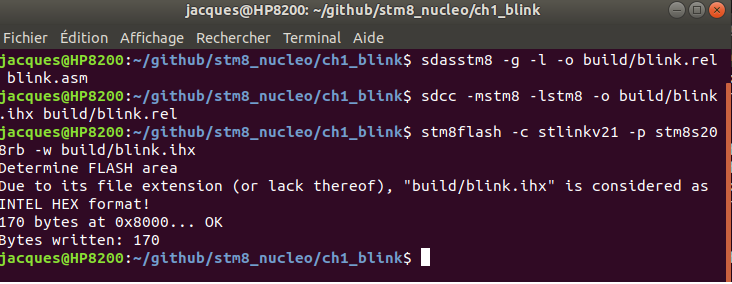

# Chapitre 1, programme blink.asm

Ce programme est le plus simple qu'on puisse imanginer mais il va nous permettre d'introduire plusieurs éléments d'un fichier source assembleur pour sdasstm8.

## Description du code source
### Commentaires
```
;;;;;;;;;;;;;;;;;;;;;;;;;;;;;;;;;;;;;;;;;;;;;;;;;;;;;;;;;;;;;;
;   tutoriel sdas pour stm8
;   chapitre 1  blink
;   Date: 2019-10-30
;   Copyright Jacques Deschêens, 2019
;   licence:  CC-BY-SA version 2 ou ultérieure
;
;   Description: Clignotement de la LED2 sur la carte
;;;;;;;;;;;;;;;;;;;;;;;;;;;;;;;;;;;;;;;;;;;;;;;;;;;;;;;;;;;;;;
```
  Tout ce qui ce trouve à partir du caractère **;** jusqu'à la fin de la ligne est une commentaire et est ignoré par l'assembleur. Un commentaire peut suivre une directive ou une instruction machine sur la même ligne.

###  Inclusion d'un fichier
```
    .include "../inc/nucleo_8s208.inc"
    .include "../inc/stm8s208.inc"
```
La directive **.include** informe l'assembleur qu'il doit suspendre la compilation du fichier courant pour compiler le fichier à inclure. Dans cet exemple 2 fichiers sont inclus, le premier  **"../inc/nucleo_8s208.inc"** qui contient des définitions de constantes d'assembleur spécifique à la carte **NUCLEO-8S208RB**  et le deuxième **"../inc/stm8s208.inc"** contient toutes les constantes définissant les adresses des registres de périphiques ainsi que les noms de bits à l'intérieur de chacun de ces registres. Ces informations sont spécifique au **stm8s208rb**.

### macros
```
;;;;;;;;;;;;;;;;;;;;;;;;;;;;;;;;;;;;;;;;;;;;;;;;;;;;;;;;;;;;;;
;           macros
;;;;;;;;;;;;;;;;;;;;;;;;;;;;;;;;;;;;;;;;;;;;;;;;;;;;;;;;;;;;;;
    ; allume LED2
    .macro _ledon
    bset LED2_PORT,#LED2_BIT
    .endm

    ; éteint LED2
    .macro _ledoff
    bres LED2_PORT,#LED2_BIT
    .endm
   
    ; inverse l'état de LED2
    .macro _led_toggle
    ld a,LED2_PORT
    xor a,#LED2_MASK
    ld LED_PORT,a
    .endm
```

L'assembleur possède un langage de *macros*  ici nous définissons 3 macros.
Les macros débutes par la directive **.macro** qui est suivit du nom de la macro. La macro se termine par la directive **.endm**.  Lorsqu'une macro est invoquée dans le texte source l'assembleur remplace son nom par les instructions qui se trouvent entre entre les 2 directives. Ici nous avons définit 3 macros **_ledon** pour allumer la LED **_ledoff** pour l'éteindre et **_led_toggle** pour inverser sont état. Dans blink.asm seul les 2 premières sont utilisées. Plus loin je vais montrer comment modifier le programme pour utiliser la 3ième à la place des 2 autres.

J'utilise le caractère **_** pour débuter le nom des macros, ce qui me permet au premier coup d'oeil de comprendre qu'il s'agit bien d'une macro et nom d'une étiquette.

### segment de donnée
```
;;;;;;;;;;;;;;;;;;;;;;;;;;;;;;;;;;;;;;;;;;;;;;;;;;;;;;;;;;;;;;
;       section des variables
;;;;;;;;;;;;;;;;;;;;;;;;;;;;;;;;;;;;;;;;;;;;;;;;;;;;;;;;;;;;;;
    .area DATA
;;;;;;;;;;;;;;;;;;;;;;;;;;;;;;;;;;;;;;;;;;;;;;;;;;;;;;;;;;;;;;
;       section de la pile
;;;;;;;;;;;;;;;;;;;;;;;;;;;;;;;;;;;;;;;;;;;;;;;;;;;;;;;;;;;;;;
    STACK_SIZE = 256
    STACK_TOP = RAM_END-1

    .area SSEG (ABS)
    .org RAM_END-STACK_SIZE
    .ds STACK_SIZE

```
La directive **.area**  sert à définir les différentes sections du programme. Un programme se divise en plusieurs section la section **DATA** est une section de la mémoire **RAM** où sont les variables du programme.
la section **SSEG** est la section qui contient la pile pointée par le pointeur de pile **SP** du cpu. l'option **(ABS)** indiqué pour la section **SSEG** indique que le linker ne peut déplacer celle-ci. Elle doit débuter obligatoirement à l'adresse indiquée par la directive **.org RAM_EN-STACK_SIZE**. La directive **.ds STACK_SIZE** indique le nombre d'octets qu'on réserve pour la pile. Ce morceau de code nous indique aussi comment on définit des constantes symboliques pour l'assembleur, **STACK_SIZE** et **STACK_TOP**. Chaque fois que l'assembleur rencontre une constante symbolique dans le texte il la remplace par sa valeur.

```
;;;;;;;;;;;;;;;;;;;;;;;;;;;;;;;;;;;;;;;;;;;;;;;;;;;;;;;;;;;;;;
;     table des vecteurs d'interruption
;;;;;;;;;;;;;;;;;;;;;;;;;;;;;;;;;;;;;;;;;;;;;;;;;;;;;;;;;;;;;;
    .area HOME
    int main  ; vecteur de réinitialisation
	int NonHandledInterrupt ;TRAP  software interrupt
	int NonHandledInterrupt ;int0 TLI   external top level interrupt
	int NonHandledInterrupt ;int1 AWU   auto wake up from halt
	int NonHandledInterrupt ;int2 CLK   clock controller
	int NonHandledInterrupt ;int3 EXTI0 port A external interrupts
	int NonHandledInterrupt ;int4 EXTI1 port B external interrupts
	int NonHandledInterrupt ;int5 EXTI2 port C external interrupts
	int NonHandledInterrupt ;int6 EXTI3 port D external interrupts
	int NonHandledInterrupt ;int7 EXTI4 port E external interrupts
	int NonHandledInterrupt ;int8 beCAN RX interrupt
	int NonHandledInterrupt ;int9 beCAN TX/ER/SC interrupt
	int NonHandledInterrupt ;int10 SPI End of transfer
	int NonHandledInterrupt ;int11 TIM1 update/overflow/underflow/trigger/break
	int NonHandledInterrupt ;int12 TIM1 capture/compare
	int NonHandledInterrupt ;int13 TIM2 update /overflow
	int NonHandledInterrupt ;int14 TIM2 capture/compare
	int NonHandledInterrupt ;int15 TIM3 Update/overflow
	int NonHandledInterrupt ;int16 TIM3 Capture/compare
	int NonHandledInterrupt ;int17 UART1 TX completed
	int NonHandledInterrupt ;int18 UART1 RX full
	int NonHandledInterrupt ;int19 I2C 
	int NonHandledInterrupt ;int20 UART3 TX completed
	int NonHandledInterrupt ;int21 UART3 RX full
	int NonHandledInterrupt ;int22 ADC2 end of conversion
	int NonHandledInterrupt	;int23 TIM4 update/overflow
	int NonHandledInterrupt ;int24 flash writing EOP/WR_PG_DIS
	int NonHandledInterrupt ;int25  not used
	int NonHandledInterrupt ;int26  not used
	int NonHandledInterrupt ;int27  not used
	int NonHandledInterrupt ;int28  not used
```
La section **.area HOME** doit contenir la liste des gestionnaires d'interruption. Le premier vecteur n'est pas vraiment un gestionnaire d'interruption il indique plutôt l'adresse d'entrée du code qui doit-être exécuté après une réinitialisation du MCU. Dans ce cas ci c'est l'étiquette **main** qui est donnée comme point d'entrée. Comme ce programme n'utilise aucune interruption tous les vecteur pointent vers **NonHandledInterrupt** qui a pour effet de réinitialiser le MCU car si une interruption non gérée est déclenchée celà implique soit un bogue dans le programme ou une défectuosité matérielle. La section **HOME** est installée au début de la mémoire FLASH à l'adresse **0x8000**. Chaque vecteur occupe 4 octets. **int** est l'instruction machine utilisée pour lancer les gestionnaires d'interruptions. Lors d'une interruption tous les registres sont sauvegardés sur la pile avant de lancer le gestionnaire. Ça occupe 9 octets sur la pile.

Les 3 sections **DATA**, **SSEG** et **HOME** sont à déclaration obligatoire. Si une section obligatoire n'est pas déclarer le programme peut quand même être assemblé mais le *linker* va terminer avec une erreur.
```
    .area CODE
;;;;;;;;;;;;;;;;;;;;;;;;;;;;;;;;;;;;;;;;;;;;;;;;;;;;;;;;;;;;;;
;   point d'entrée après une réinitialisation du MCU
;;;;;;;;;;;;;;;;;;;;;;;;;;;;;;;;;;;;;;;;;;;;;;;;;;;;;;;;;;;;;;
main:
; initialisation de la pile
    ldw x,#STACK_TOP
    ldw sp,x
; initialise la broche du LED2 en mode 
; sortie push pull
    bset PC_CR1,#LED2_BIT
    bset PC_CR2,#LED2_BIT
    bset PC_DDR,#LED2_BIT
; invoke la macro pour éteindre la LED2
1$:
    _ledoff
;   délais
    call delay
; invoke la macro pour allumer la LED2    
    _ledon  
    call delay
    jra 1$

;;;;;;;;;;;;;;;;;;;;;;;;;;;;;;;;;;;;;;;;;;;;;;;;;;;;;;;;;;;;;;
;   sous-routine de délais
;;;;;;;;;;;;;;;;;;;;;;;;;;;;;;;;;;;;;;;;;;;;;;;;;;;;;;;;;;;;;;
delay:
    pushw x
    ldw x,#0xffff
1$: decw x
    jrne 1$
    popw x 
    ret 
```
La section **.area CODE** indique une section de code qui sera programmée dans la mémoire FLASH du MCU. Les étiquettes se terminent par le caractère **:**. Ici l'étiquette **main:** indique le point d'entrée après un *reset** du MCU tel qu'indiqué dans le premier vecteur de la table ci-haut. Le nom importe peut on aurait put la nommée **init0:** ou n'importe quoi d'autre.

La première étape consiste à initialiser le pointeur de pile **SP**. Ensuite on initialise la broche **5** du port **C** en sortie *push-pull* car c'est la broche qui contrôle la LED2 qui est sur la carte. Comme ces informations sont spécifiques à cette carte **LED2_BIT** et **LED2_MASK** sont définis dans le fichier **nucleo_8s208.inc** alors que **PC_CR1**,**PC_CR2** et **PC_DDR** ainsi que **PC_ODR** sont définis dans **stm8s208.inc** car spécifique au MCU.

A partir de l'étiquette **1$:** c'est la boucle du programme qui commence.
les étiquettes de la forme **n$:** sont des étiquettes spéciales qui peuvent-être réutilisées. Elles ne sont valide qu'à l'intérieur d'un bloc de code délimité. Comme on le voit ici la première étiquette **1$:** qui apparaît après l'étiquette **main:** n'est valide que jusqu'à l'étiquette **delay:** et l'étiquette **1$:** qui apparaît après **delay:** n'est valide que jusqu'à la rencontre d'une autre étiquette normale. dans ce cas ci c'est
**NonHandledInterrupt:**. Ces étiquettes spéciales réutilisables sont très pratique en réduisant le risque de collision de noms dans un programme plus complexe. 

Pour en revenir au programme principal, au début de la boucle on invoque la macro **_ledoff** pour éteindre la LED2. Ensuite on appelle la sous-routine **delay** pour après cet appel allumer la LED2 en invoquant **_ledon**. Un autre délais puis on recommence la boucle avec l'instruction **jra 1$**.

La sous-routine **delay** utilise le registre **X** comme un compteur à rebours. On utilise la valeur maximale **0xffff**. Ce délais est suffisant pour que le clignotement soit suffisamment lent pour le percevoir. 

C'est une bonne habitude lorsqu'une sous-routine utilise un registre de sauvegarder celui-ci sur la pile **(pushw x)** avant de modifier son contenu et de le restaurer **(popw x)** avant de quitter la sous-routine. Ça peut éviter bien des bogues. 

### modification au programme
Voici une solution alternative pour faire clignoter la LED2 en utilisant la macro **_led_toggle**
```
1$:
    call delay
    _led_toggle  
    jra 1$
```
Cette variante donne le même résultat mais avec moins de code.


```
;;;;;;;;;;;;;;;;;;;;;;;;;;;;;;;;;;;;;;;;;;;;;;;;;;;;;;;;;;;;;;
;	gestionnaire d'interruption pour
;   les interruption non gérées
;   réinitialise le MCU
;;;;;;;;;;;;;;;;;;;;;;;;;;;;;;;;;;;;;;;;;;;;;;;;;;;;;;;;;;;;;;
NonHandledInterrupt:
	ld a,#0x80
	ld WWDG_CR,a
    ;iret
```
À la fin du fichier on retrouvre le gestionnaire d'interruption **NonHandleInterrupt**. Les 2 instructions machine qu'on y retrouve on pour effet de réinitialiser le MCU.  Normalement un gestionnaire d'interruption doit se terminer par l'instruction **iret**. Je l'ai mise en commentaire ici puisqu'elle n'est jamais exécutée à cause de la réinitialisation.

## Construction du projet
La construction du projet se fait en 3 étapes.
* assemblage
* génération du binaire
* programmation du mcu

Pour que ce soit plus propre je préfère créer un dossier **build** ou j'envoie les fichiers créés par lors de la construction du projet.
Sur la ligne de commande dans le dossier **ch1_blink**
```
    mkdir build
```

### assembler le fichier
```
sdasstm8 -g -l -o build/blink.rel blink.asm
```
Après cette opération il y aura 2 fichiers dans **build**, **blink.rel** et **blink.lst**. **blink.lst** est le listing généré par l'assembleur. **blink.rel**  est aussi un fichier texte mais qui contient une réprentation hexadécimal du code binaire avec les adresses relative, d'où l'exteseion **.rel**. 

Dans un programme plus complexe comprenant plusieurs fichiers source, chaque fichier doit-être assemblé séparément.
### lier le fichier
```
sdcc -mstm8 -lstm8 -o build/blink.ihx build/blink.rel
```
On utilise sdcc pour en fait invoquer le générateur de lien *(linker)*. Le linker est responsable d'attribuer des adresses absolues à chaque section du programme. Même si un programme asssemble sans erreur il est possible que cette étape génère des erreurs. Par exemple s'il y a conflit d'adresse entre 2 sections déclarées comme (ABS), ou encore qu'une section à déclaration obligatoire soit absente.

Ce petit programme n'a qu'un fichier **.rel** est s'il y en a plusieurs ils doivent tous être énumérés à la fin la commande.

Cette phase génère plusieurs fichiers mais celui qui nous intéresse pour la programmation du MCU s'appelle **build/blink.ihx**. Il s'agit d'un fichier texte au format Intel hexadécimal.
### programmer le mcu
```
stm8flash -c stlinkv21 -pstm8s208rb -w build/blink.ihx
```
l'option **-c stlinkv21** indique que le type et la version du programmeur qui est sur la carte. l'option **-pstm8s208rb** indique le modèle du MCU à programmer. l'option **-w build/blink.ihx** indique le nom du fichier à programmer.
### Capture d'écran des 3 étapes



Habituellement je cré un fichier Makefile pour simplifier cette procédure.
