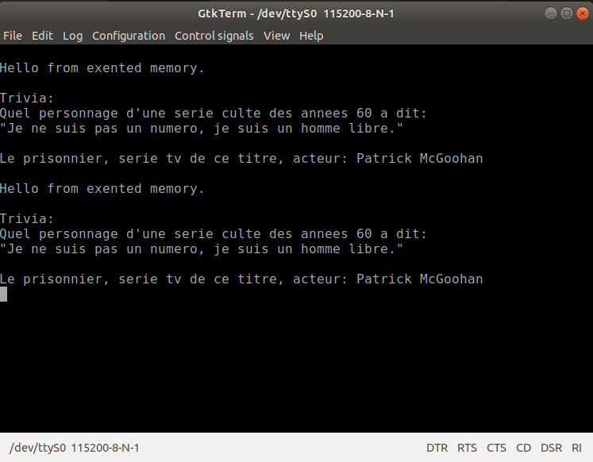

# Chapitre 3,  mémoire étendue.

Démonstration de l'utilisation de la mémoire étendue aussi bien pour les données que pour le code.

## Le compteur ordinal

Le compteur ordinal du STM8 est de 24 bits ce qui permet d'adresser 16Mo cependant il n'y a que 5 instructions machine qui modifient les 8 bits supérieur du compteur ordinal (**PCE** dans la nomenclature de STMicroelectronics). Ces instructions sont:

* **INT**  *interruption*. Utilisée seulement dans la table des vecteurs d'interruption. Une interruption sauvegarde les 3 octets du compteur ordinal **PCL,PCH et PCE**. Ce 3 octets sont remplacés par l'adresse de 24 bits indiquée dans la table. Ça implique que la routine de **RESET** et les routines d'interruptions peuvent-être installées n'importe où dans la mémoire FLASH. 

* **IRET** *sortie d'interruption*. C'est l'instruction utilisée pour sortir des interruptions. Cette instruction restaure les 9 octets sauvegardés sur la pile par **INT**.

* **CALLF**  *appel sous-routine éloignée*. Appel avec adresse de 24 bits à une sous-routine. Cet appel sauvegarde les 3 octets de **PC** sur la pile. Peut atteindre tout l'espace d'adressage.

* **RETF** *sortie d'une sous-routine éloignée*. Il faut utiliser cette instruction pour sortir d'une sous-routine appellée par **CALLF** sinon plantage assuré.

* **JPF**  *Saut éloigné*. Saut avec adresse étendue de 24 bits. Peut atteindre tout l'espace d'adressage.

### Les problèmes possibles

* **Une routine qui chevauche deux segments**, un segment c'est 64Ko, soit ce qui est adressable avec 16 bits. Supposons que la routine commence à l'adresse **0xff00** et se termine à l'adresse **0x100a0**. Cette routine ne peut-être appellée par un **CALL** car si elle se termine avec un **RET** le **PCE** est à **0** à son point d'entrée mais à **1** à son point de sortie. Comme l'instruction **RET** ne restaure que **PCH:PCL** le retour se fait à **0x01HHLL** au lieu de **0x00HHLL**. Donc une routine qui chevauche 2 segments doit être appellée par un **CALLF** et se terminer par un **RETF**.
 À moins de s'assurer que le point de sortie est dans le même segment que le point d'entrée.

* **Appel inter-segment**. Une routine qui se termine par un **CALL** ne peut-être appellée que par une autre routine qui est dans le même segment et elle doit se terminer par un **RET**. Si une routine en appelle une autre qui est dans un autre segment cette dernière doit-être appellée par un **CALLF** et la sous-routine appellée doit se terminer par un **RETF**.

Donc lorsqu'on écris un programme en assembleur il faut faire très attention à la façon dont on organise le code.  Si on sait que le programme va être plus gros que 32Ko il faut prendre le temps de réfléchir à la bonne stratégie à utiliser. J'ai bien écris 32Ko car la mémoire FLASH débute à l'adresse **0x8000** donc il n'y a que 32Ko disponible avant l'adresse étendue **0x10000**. 

### Statégies à envisager.

1.  Le plus simple est de n'utiliser que des instructions **CALLF** et **RETF**. pour les sous-routines. Il y a 3 inconvénients. Ça prend plus d'espace mémoire puisque **CALLF** occupe 4 octets alors qu'un **CALL** varie entre **1 et 4** octets dépendant du mode d'adressage utilisé. Dans la majorité des cas ce sera **3** octets. Comme il y a un octet de plus à empiler par **CALLF** et à dépiler par le **RETF** ces appels prennent 2 cycles de plus.  Le 3ième inconvénient est le nombre limité de mode d'adressage. un **CALLF** ne peut utiliser que le mode direct ou le mode par pointeur. Le **CALL** peut utiliser 12 modes d'adressage.

1. Segmenter l'application en modules qui ne sont contenus que dans 1 seul segment. l'interface entre les différents modules peut se faire par interruption logiciels **TRAP** ou encore par une inteface d'appels bien définie utilisant exclusiement des **CALLF**

## programme hello.asm

### Que fait ce programme

Ce programme envoie des messages à un émulateur de terminal situé sur l'ordinateur. La communication se fait par port sériel en utilisant le **UART3**. Ce programme a deux variantes sur lequelles je vais revenir lors de l'analyse du code source.

Ce programme utilise la deuxième stratégie. Le code d'initialisation réside dans le segment **0** mais ne fait aucun appel dans un autre segment. L'application fonctionne par interruption. Lorsque le bouton **USER** est enfoncé l'interruption **usr_btn_isr** est activée. J'ai placé cette interruption dans le segment **1** ainsi que les sous-routines qu'elles utilise. Donc tout le code qui est exécuté pendant l'interruption se déroule dans le segment **1**. Il n'est donc pas nécessaire d'utiliser de **CALLF**.

### Analyse du code source.

J'ai repris le progamme du chapitre 2 et l'ai modifié.

```
;;;;;;;;;;;;;;;;;;;;;;;;;;;;;;;;;;;;;;;;;;;;;;;;;;;;;;;;;;;;;;
;       section des variables
;;;;;;;;;;;;;;;;;;;;;;;;;;;;;;;;;;;;;;;;;;;;;;;;;;;;;;;;;;;;;;
    .area DATA
farptr:  .blkb 1 ; pointeur étendu octet supérieur [23:16]
farptrM: .blkb 1 ; pointeur étendu octet du milieur [15:8]
farptrL: .blkb 1 ; pointeru étendu octet faible [7:0]
phase:   .blkb 1 ; indique message à afficher

```
Ce programme utilise des variables. **farptr** est un pointer vers un texte
qui est dans la mémoire étendue. Ce pointeur est donc initialisé avec une adresse de 24 bits. Du à une limitation de l'assembleur **sdasstm8** j'ai été obligé de fragmenter cette variable en 3 octets séparés alors qu'en fait il s'agit de la même variable. **farptrM** et **farptrL** sont les 2 octets les plus faibles du pointeur **farptr**. Pour simplifier l'initialisation de cette variable j'ai créé la macro **_ld_farptr**.
```
    ; initialise farptr avec l'adresse étendu d'un message
    .macro _ld_farptr  msg 
    ld a,#msg>>16
    ld farptr,a
    ld a,#msg>>8
    ld farptrM,a
    ld a,#msg
    ld farptrL,a
    .endm
```
Cette macro utilise une argument **msg** qui est l'adresse du mesage qui 
sert à initialiser le pointeur. Six instructions simplement pour initialiser ce pointeur! C'est du à une limitation de **sdasstm8**. En effet ça aurait put-être fait de la façon suivante:
```
    ; initialise farptr avec l'adresse étendu d'un message
    .macro _ld_farptr  msg 
    ldw a,#msg>>8
    ldw farptr,x
    ld a,#msg
    ld farptrL,a
    .endm
```
Mais **sdasstm8** ne reconnais pas l'instruction **ldw x,#msg>>8** qui permettrait de charger les 2 octets supérieurs du pointeur en 2 instructions au lieu de 4. Pourquoi  cet assembleur accepte une instruction de la forme **ld a,#msg>>n** et non la forme **ldw x,#msg>>n**? Mystère et boule de gomme.

### initialisation

La phase d'initialisation du programme ajoute plusieurs éléments par rapport à [button.asm](../ch2_btn/button.asm). 

```
    .area CODE
;;;;;;;;;;;;;;;;;;;;;;;;;;;;;;;;;;;;;;;;;;;;;;;;;;;;;;;;;;;;;;
;   point d'entrée après une réinitialisation du MCU
;;;;;;;;;;;;;;;;;;;;;;;;;;;;;;;;;;;;;;;;;;;;;;;;;;;;;;;;;;;;;;
main:
; initialisation de la pile
    ldw x,#STACK_TOP
    ldw sp,x
; initialise la variable farptr avec message hello
    _ld_farptr hello
;   initialise variable phase
    clr phase    
; initialise le clock système
    call clock_init
; initialise la communication sérielle
    call uart3_init        
; initialise la broche du LED2 en mode 
; sortie push pull
    bset PC_CR1,#LED2_BIT
    bset PC_CR2,#LED2_BIT
    bset PC_DDR,#LED2_BIT
; active l'interruption sur bouton utilisateur sur
; la transition descendante seulement
    bset EXTI_CR2,#1    
; active l'interruption sur PE_4 bouton utilisateur
    bset PE_CR2,#USR_BTN_BIT
; active les interruptions
    rim 
; boucle vide. Tout est fait par l'interruption.
; puisque le CPU ne fait entre les interruption
; l'instrcution WFI  (Wait For Interrupt) est utilisée
; pour diminuer la consommation électrique.
1$: wfi
    jra 1$
```
* La variable **farptr** est initialisée avec l'adresse du message **hello** par invocation de la macro **_ld_farptr hello**.
* La variable **phase** est initialisée à **0**.
* La sous-routine **clock_init** est appellée. Ce programme fonctionne à 8 Mhz au lieu de 2 Mhz pour les précédents.
* La sous-routine **uart3_init** est appellée pour initialiser le périphérique de communication sériel **UART3**.
* La boucle infinie utilise l'instruction **wfi** au lieu de **halt** qui était utilisée dans button.asm. La raison en est que l'oscillateur **HSE** est arrêté par l'instruction **HALT** et que son temps de démarrage est trop long. La fréquence de l'oscillateur n'a pas le temps de se stabiliser pendant l'interruption générée par le bouton enfoncée. La conséquence résultante est  que la communication sériel n'est pas fiable car le BAUDRATE dépend de la stabilité de cet oscillateur. **wfi** n'arrête pas l'oscillateur **HSE** ce qui évite ce problème.

### initialisation clock et UART3
```
;;;;;;;;;;;;;;;;;;;;;;;;;;;;;;;;;;;;;;;;;;;;;;;;;;;;;;;;;;;;;;
; initialise le UART3, configuration: 115200 8N1
;;;;;;;;;;;;;;;;;;;;;;;;;;;;;;;;;;;;;;;;;;;;;;;;;;;;;;;;;;;;;;
uart3_init:
;	bset CLK_PCKENR1,#CLK_PCKENR1_UART3
	; configure tx pin
	bset PD_DDR,#BIT5 ; tx pin
	bset PD_CR1,#BIT5 ; push-pull output
	bset PD_CR2,#BIT5 ; fast output
	; baud rate 115200 Fmaster=8Mhz  8000000/115200=69=0x45
	mov UART3_BRR2,#0x05 ; must be loaded first
	mov UART3_BRR1,#0x4
	mov UART3_CR2,#((1<<UART_CR2_TEN)|(1<<UART_CR2_REN));|(1<<UART_CR2_RIEN))
	ret

;;;;;;;;;;;;;;;;;;;;;;;;;;;;;;;;;;;;;;;;;;;;;;;;;;;;;;;;;;;;;;
;initialize clock, configuration HSE 8 Mhz
;;;;;;;;;;;;;;;;;;;;;;;;;;;;;;;;;;;;;;;;;;;;;;;;;;;;;;;;;;;;;;
clock_init:	
	bset CLK_SWCR,#CLK_SWCR_SWEN
	ld a,#CLK_SWR_HSE
	ld CLK_SWR,a
1$:	cp a,CLK_CMSR
	jrne 1$
    clr CLK_CKDIVR
	ret
```
Pour utiliser ce programme il faut un adapteur de niveau pour port sériel entre la carte NUCLEO-8S208RB et le port sériel de l'ordinateur. Si l'ordinateur n'a pas de port sériel il faut en plus un adapteur USB/RS-232.

* **uart3_init** est la sous-routine qui initialise le périphérique UART3. La broche de transmission est sur le port PD_5 relié au connecteur CN7-2. La broche de réception est sur PD_6 et reliée à CN7-1. 
* **clock_init**  Initialise le *clock system* pour utiliser l'oscillateur externe **HSE** avec le cristal de 8 Mhz qui est sur la carte. Le registre **CLK_CKDIRV** est mis à zéro car aucune division de fréquence n'est souhaitée.

### un pointeur en mémoire FLASH
```
;;;;;;;;;;;;;;;;;;;;;;;;;;;;;;;;;;;;;;;;;;;;;;;;;;
;    pointeur constant installé dans la mémoire 
;    flash. Les pointeurs ne peuvent-être que dans
;    le segment 0 i.e. 0x0000-0xffff
;;;;;;;;;;;;;;;;;;;;;;;;;;;;;;;;;;;;;;;;;;;;;;;;;;
const_ptr: 
        .byte (hello>>16),(hello>>8),hello 
```
J'ai créé un pointeur en  mémoire FLASH pour l'option **0** du démo (voir plus bas). Autre aspect malcommode de *sdasstm8* la directive **.3byte hello** qui permettrait simplement d'initialiser ce pointeur n'est pas reconnue par l'assembleur. J'ai donc du utililser la directive **.byte** et fragmenter chaque octet de l'adresse avec l'opérateur **>>**. 

### Mémoire étendue

Le reste du code est en mémoire étendue débutant à l'adresse **0x10000**.
```
;;;;;;;;;;;;;;;;;;;;;;;;;;;;;;;;;;;;;;;;;;;;;;;;;;;;
;  section de code situé dans la mémoire étendue
;;;;;;;;;;;;;;;;;;;;;;;;;;;;;;;;;;;;;;;;;;;;;;;;;;;;
    .area CODE_FAR (ABS)
    .org 0x10000 ; segment 1 de la mémoire étendue
```
J'ai déclaré une section de code avec l'attribue **(ABS)** suivie de la directive **.org 0x10000** pour m'assurer que ce qui suit débute bien à l'adresse étendue **0x10000**. 

## Routines de communication
```
;------------------------------------------
;  routines de communications port sériel
;------------------------------------------
;------------------------------------
; Transmet le caractère qui est dans A 
; via UART3
;------------------------------------
uart_tx:
	btjf UART3_SR,#UART_SR_TXE,uart_tx
	ld UART3_DR,a
    ret

;------------------------------------
; transmet le message via UART3
; utilise un adresse par pointeur
; indexé par Y. 
;------------------------------------
    USE_PTR = 1 ; mettre à 0 pour pointeur dans mémoire flash
print_msg:
    pushw x
    pushw y
    clrw y
    .if USE_PTR
    ; initialise farptr
    tnz phase
    jreq ph0 
    btjt phase,#0,ph1
ph2: 
    _ld_farptr reponse
    jra print
ph1:
    _ld_farptr trivia
    jra print
ph0:
    _ld_farptr hello         
print:
     ldf a,([farptr],y) ; addressage par pointer en RAM
    .else    
print:
	ldf a,([const_ptr],y)  ; adressage indexé avec offset étendu
    .endif
	jreq 9$
	call uart_tx
	incw y
	jra print
9$:
    .if USE_PTR
    inc phase
    ld a,#3
    cp a,phase
    jrne 10$
    clr phase
    .endif
10$:    
    popw y
    popw x
    ret
```

* **uart_tx** ne fait que transmettre un caractère via le UART3.
* **print_msg**  envoie une chaîne de caractère terminée par un **0**.
Chaque caractère est chargé dans **A** puis **uart_tx** est appellé. C'est ici qu'on utilise un **adressage par pointeur indexé**. Le registre **Y** est utilisé comme index. l'instruction 
```
ldf a,([farptr],y)
```
 additionne le contenu de **Y** à l'adresse contenue dans la variable **farptr** et cette adresse effective est celle du caractère qui est chargé dans **A**.  Il suffit d'incrémenté **Y** pour accéder les caractères de la chaîne l'un après l'autre. Lorsque la valeur chargée dans **A** est zéro on sort de la boucle d'impression.

 le symbole **USE_PTR** définit au début de **print_msg** permet de compiler 2 programmes différents. Si **USE_PTR** est à 1 le pointeur utilisé est celui qui est en mémoire RAM **farptr**. L'intérêt d'un pointeur en mémoire RAM est qu'on peut modifier sa valeur. Et c'est ce qu'on fait ici. Dépendant de la valeur de la variable **phase** on initialise **farptr** avec un message différent:

 * **phase==0**,  _ld_farptr hello 
 * **phase==1**,  _ld_fartr trivia
 * **pahse==2**,  _ld_farptr reponse

 Dans cette version du programme la valeur de **phase** est incrémentée à chaque interruption et revient à zéro lorqu'elle atteint **3**. On a donc 3 messages qui se succèdent en boucle.



Maintenant si **USE_PTR = 0** est définie, la version du programme qui est compilé utilise le pointeur en mémoire flash **const_ptr** et puisque sa valeur ne peut pas être modifiée c'est toujours le même message qui apparaît.

### Interruptions

```
;;;;;;;;;;;;;;;;;;;;;;;;;;;;;;;;;;;;;;;;;;;;;;;;;;;;;;;;;;;;;;
;	gestionnaire d'interruption pour
;   les interruption non gérées
;   réinitialise le MCU
;;;;;;;;;;;;;;;;;;;;;;;;;;;;;;;;;;;;;;;;;;;;;;;;;;;;;;;;;;;;;;
NonHandledInterrupt:
	ld a,#0x80
	ld WWDG_CR,a
    ;iret

;;;;;;;;;;;;;;;;;;;;;;;;;;;;;;;;;;;;;;;;;;;;;;;;;;;;;;;;;;;;;;
;       gestionnaire d'interruption pour le bouton USER
;;;;;;;;;;;;;;;;;;;;;;;;;;;;;;;;;;;;;;;;;;;;;;;;;;;;;;;;;;;;;;
    DEBOUNCE = 0 ; mettre à zéro pour annule le code anti-rebond.
usr_btn_isr:
    _ledon
    call print_msg
    .if DEBOUNCE
; anti-rebond
; attend que le bouton soit relâché
1$: clrw x
    btjf USR_BTN_PORT,#USR_BTN_BIT,1$ 
; tant que le bouton est relâché incrémente X 
; si X==0x7fff quitte
; si bouton revient à zéro avant retourne à 1$     
2$: incw x
    cpw x,#0x7fff
    jreq 3$
    btjt USR_BTN_PORT,#USR_BTN_BIT,2$
    jra 1$
    .endif; DEBOUNCE
    _ledoff  
3$: iret


    hello:
        .byte   12
        .asciz  "Hello from exented memory.\n"
    trivia:
        .byte 12
        .ascii "Trivia:\n"
        .ascii "Quel personnage d'une serie culte des annees 60 a dit:\n"
        .byte '"'
        .ascii "Je ne suis pas un numero, je suis un homme libre."
        .byte '"','\n',0
    reponse:
        .asciz "\nLe prisonnier, serie tv de ce titre, acteur: Patrick McGoohan\n"
```
L'interruption **usr_btn_isr** appelle la sous-routine **print_msg** qui fait le gros du travail dans ce programme.

Les messages qui sont envoyés au terminal apparaissent à la fin du fichier.
Si l'émulateur de terminal utilisé sur l'ordinateur est compatible VT100, le caractère **12** au début d'un message a pour effet d'effacer l'écran. gtkTerm n'est pas compatible VT100 et ce caractère ne génère qu'un saut de ligne.

### accès au données en mémoire étendue.

En ce qui concerne l'accès au données en mémoire étendue la seule instruction disponible  est **ldf**.  Dans ce démo on a utilisé un pointeur indexé mais aurait pu utiliser un adressage par adresse indexée.
```
    ldf a,(hello,y)
```
Ici l'adresse du message *hello* est directement utilisée et indexée par **Y**. La vitesse d'exécution de ce mode d'adressage est plus rapide que par pointeur.

Il est important de ce rappeler que les pointeurs qu'ils soient variables en RAM ou constants en FLASH doivent obligatoirement être situés avant l'adresse **0x10000** (65536). En effet les instructions machines n'utilise que 2 octets pour coder l'adresse d'un pointeur.


