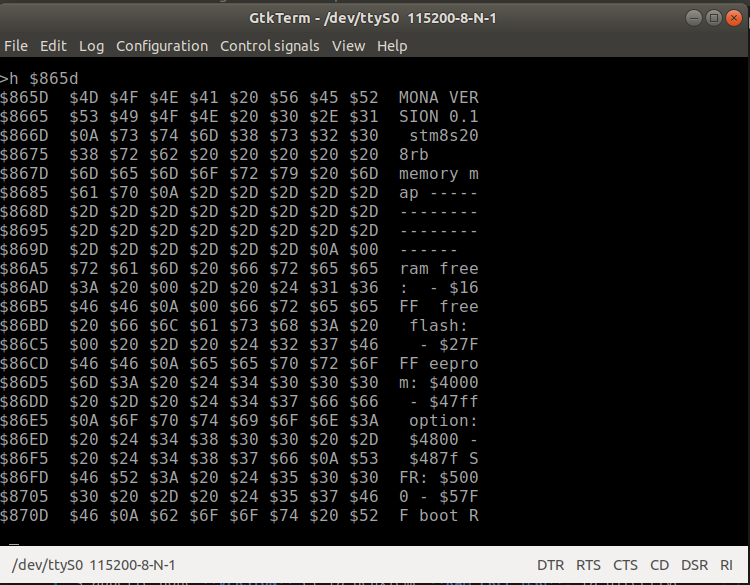
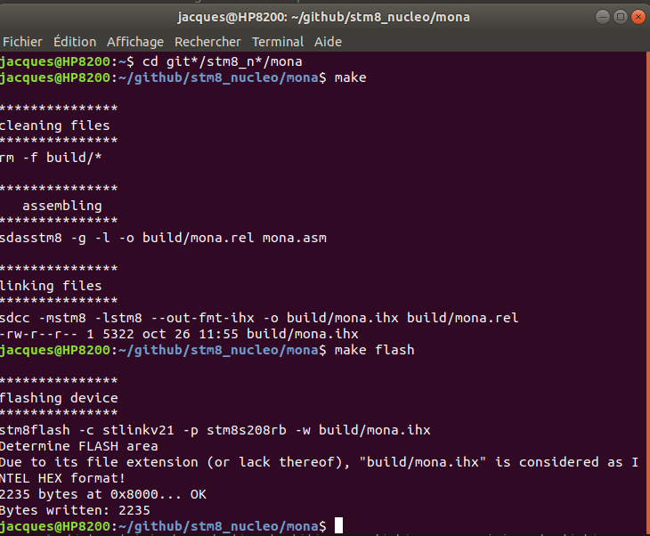

# Analyse du programme MONA

## présentation

Analyse du fichier [mona02.asm](mona02.asm). Les deux documents requis pour suivre ce didactitiel sont dans le dossier **docs**. Il s'agit de [asmlnk.txt](../docs/asmlnk.txt) qui documente l'assembleur et le linker. L'autre est le [manuel de programmation du STM8](../docs/pm0044_stm8_programming.pdf) qui est la référence pour la progammation des STM8. 

Un programme en assembleur contient les éléments suivants:
* Des commentaires.
* Des dierctives à l'assembleur.
* Des définitions de symboles représentant des constantes.
* Des définitions de macros.
* Diverses sections de données.
* Diverses sections de code.

### Commentaires

Les commentaires débutent par le caractère **';'** et se terminent à la fin de la ligne. Un commentaire peut-être placé après une directive ou une ligne de code. Sitôt que l'assembleur rencontre le caractère **';'** il ignore tous les caractères qui suivent jusqu'à la fin de la ligne.
Exemple:
```
;  MONA   MONitor written in Assembly

```

### Directives 

Les directives à l'assembleur. Ces directives commencent toutes par un **'.'** suivit sans espace par le nom de la directive. La directive elle même peut-être suivit d'un certain nombre d'arguments. Exemple:
``` 
.org 0x4000 
``` 
Cette directive indique à l'assembleur que le pointeur de code doit-être positionné à l'adresse 0x4000. Ce qui signifie que les instructions machines qui suivent seront assemblée à partir de cette adresse.

Il y a de nombreuses directives mais dans cette introduction je ne présenterai que celles utilisée dans **mona.asm**.

### Définition de constantes utilisées par l'assembleur

Les constantes numériques sont des noms symboliques assignées à certaines valeurs. Plutôt que d'utiliser ces valeurs numérique directement dans le programme il est préférable de leur donner un nom. Un nom c'est plus significatif qu'un simple chiffre. De plus si cette valeur est utilisée à plusieurs endroits dans le programme et qu'on veut la modifier il suffit de la faire dans la définition de son symbole. De plus comme un même entier peut avoir plusieurs significations leur donner un nom permet de les distinguer et d'éviter des erreurs. exemple:
```
TIB_SIZE = 80 ; grandeur du tampon tib.
PAD_SIZE = 80 ; grandeur du tampon pad.
```
On a ici un exemple du même entier désigant deux choses différentes. Puisqu'on les a nommé différemment on peut modifié l'une sans qu'il y est confusion. Chaque fois que l'assembleur rencontre l'un de ces symbole dans le texte il le remplace par sa valeur.

Après le signe **=** on peut utiliser une expression arithmétique pour définir la valeur de la constante. Cette expession peut contenir des constantes définies auparavant.

### Les macros

SDAS supporte un langage de macros. Les macros sont des blocs d'instructions auquel on associe un nom. Lorsque l'assembleur rencontre ce nom dans le texte il le remplace par les instructions qui font parties de la définition de la macro. Les macros peuvent avoir des arguments mais je n'aborderai pas cette notion dans cette introduction. Exemple:
```
		.macro _ledenable ; set PC5 as push-pull output fast mode
		bset PC_CR1,#LED2_BIT
		bset PC_CR2,#LED2_BIT
		bset PC_DDR,#LED2_BIT
		.endm
```
La définition d'une macro débute par la directive **.macro** et se termine par la directive **.endm**. La directive **.macro** est suivie du nom de la macro et possiblement par une liste d'argument. Dans cet exemple chaque fois que l'assembleur va rencontré dans le texte le mot **_ledenable** il va remplacé ce mot par les 3 instructions suivantes:
```
		bset PC_CR1,#LED2_BIT
		bset PC_CR2,#LED2_BIT
		bset PC_DDR,#LED2_BIT
```

### Les données

Un programme comprend des instructions et des données. Certaines de ces données prennent différentes valeurs lors de l'exécution du programme, on les appelles donc des **variables**. D'autres données sont ne varient pas on les appelle donc **constantes**. 

#### variables
Les variables sont conservée en mémoire RAM et puisque le contenu de la mémoire RAM est perdu lorsqu'on éteint le microcontrôleur ces variables ne peuvent pas être initialisées lors de la programmation du microcontrôleur. On doit donc prévoir leur initialisation au démarrage. Exemple:
```
	.area DATA
tib:	.blkb TIB_SIZE ; transaction input buffer
pad:	.blkb PAD_SIZE ; working pad
```
La directive **.area** indique à l'assembleur qu'on débute une nouvelle section. Le nom **DATA** indique qu'il s'agit d'un section de variables. Donc l'assembleur ne va pas réserver d'espace dans la mémoire flash pour ces variables il va simplement ajouter leur nom à une table de symboles ainsi que l'espace requis par chacune d'elle ainsi qu'une adresse dans la RAM qui sera utilisé lors de la génération du code machine lorsqu'un de ces symbole sera référencé. La directive **.blkb** sert à réserver un certain nombre d'octets pour cette variable. On voit qu'on utilise les constantes définies auparavant pour ce faire. 

#### constantes utilisées par le programme.

Puisque les constantes gardent la même valeur en permanence elles peuvent être sauvegardées dans la mémoire FLASH avec les instructions programmes. À cet effet on leur réserve l'espace nécessaire et leur valeur est enregistrée par le programmeur en même temps que le code machine. Exemple:
```
;------------------------
; messages strings
;------------------------	
VERSION:	.asciz "MONA VERSION 0.1\nstm8s208rb     memory map\n---------------------------\n"
RAM_FREE_MSG: .asciz "ram free: "
```
Ici il s'agit de constantes de type chaîne de caractères. Pour pouvoir les référencer il faut les identifier par une étiquette. La première constante s'appelle donc **VERSION** et la deuxième **RAM_FREE_MSG**. la directive **.asciz** place les caractères entre guillemets à l'adresse courante du pointeur de code et ajoute un **0** à la fin. Si j'utilise la commande **h** de MONA pour examiner le contenu de la mémoire FLASH à l'adresse où sont enregistrés ces constantes voici ce qui s'y trouve.


On voit donc que le *linker* a placé la constante chaîne **VERSION** à l'adresse **$865D**. Et On constate qu'il a bien inséré un **0** à la fin de la chaîne à l'adresse **$86A4**.

Bien sur on peut aussi conserver des constantes numériques dans la mémoire FLASH. On s'en sert souvent pour conserver des tables de constantes.

### Le code machine

Bien sur dans un programme il y les instructions machines (le code) qui est exécuté par le CPU. L'asssembleur permet de créer plusieurs sections pour regrouper les différentes parties du code en les nommant. La directive utilisée est **.area nom opt**.  **nom** est le nom de la section et **opt** détermine les propriétés de la section. Par exemple l'option **(ABS)** stipule que cette section ne peut-être relocalisée par le *linker*. Elle est habituellemen suivie d'une directive **.org addr** qui indiquer à qu'elle adresse elle doit-être localisée.

#### Format des instructions machine
 Il y a une instruction machine par ligne. Une instruction machine peut-être précédée par une étiquette qui représente une adresse de branchement par exemple le point d'entré d'une sous-routine. 
 Une instruction débute par le mnémoniquqe qui représente cette instruction.
 Pour connaître les mnémoniques des instructions du STM8 il faut consulter le manuel de référence de programmation mentionné ci-haut. Le mnénomique peut-être suivit par une liste d'arguments. Les arguments sont séparés par la virgule. Exemple:
 ```
init0:
	; initialize SP
	ldw x,#STACK_TOP
	ldw sp,x
	call clock_init
	call clear_all_free_ram
 ```
Ces quelques lignes de code représente le début de la routine d'initialisation de MONA. L'étiquette **init0** est le nom de cette routine et est utilisée par l'assembleur pour localiser cette routine. Notez que l'étiquette peut-être sur une ligne seule. Il n'est pas nécessaire de mettre une instruction sur la même ligne mais on peut le faire. **ldw** et **call** sont des mnémoniques d'instructions machine. **ldw** requière 2 arguments alors que **call** n'en requiert qu'un seul. On peut ajouter un commentaire à la fin de l'instruction.

### Construction de l'application

Pour simplifier la construction du projet MONA j'ai créer un fichier *Makefile*. Le fichier *Makefile* utilisé a été configuré pour que les fichiers générés par l'assembleur et le linker se retrouve dans le dossier **build**. Il y en a plusieurs mais on a pas vraiment besoin  de les consulter sauf peut-être le fichier [build/mona.lst](build/mona.lst) si on veut voir de quoi à l'air le code machine généré par l'assembleur.

Voici comment fonctionne la construction d'un projet. À partir d'un shell de commande on invoke simplement la commande **make**. S'il n'y a pas d'erreur et qu'on veut programmer la carte NUCLEO-8S208RB on fait la commande **make flash**.



L'assembleur transforme le fichier source en un fichier de code binaire mais avec des adresses relatives [build/mona.rel](build/mona.rel) et génère aussi un listing appellé [build/mona.lst](build/mona.lst). Ensuite le linker (générateur de liens) utilise ces fichiers pour générer le fichier [build/mona.ihx](build/mona.ihx) qui contient le code binaire en format **Intel Hex** utilisé pour programmer le microcontrôleur. Le projet MONA contient un seul fichier source mais dans un projet plus complexe il y a plusieurs fichiers sources qui sont assemblés indépendemment les uns des autres et génèrent chacun des fichiers __*.rel__ et __*.lst__. Le travail du linker est de joindre tous ces bouts de codes ensemble en évitant les conflits d'adresses. S'il  n'y arrive pas il affiche un message d'erreur d'allocation.


## Étude de mona.asm

### Entête de module
```
;  MONA   MONitor written in Assembly
	.module MONA 
    .optsdcc -mstm8
;	.nlist
	.include "../inc/nucleo_8s208.inc"
	.include "../inc/stm8s208.inc"
;	.list
	.page

```
A part les commentaires dans le bloc précédent on n'a que des directives destinées à l'assembleur. 

* **.module MONA** nomme simplement ce fichier.
* **.optsdcc -mstm8** indique à l'assembleur qu'il s'agit de code pour le STM8
* **.nlist** Cette directive indique simplement que les lignes de code suivantes n'apparaitrons pas dans le listing généré par l'assembleur. Ici la directive a été mise en commentaire et n'a donc aucun effet.
* **.include "../inc/nucleo_8s208.inc"**  informe l'assembleur qu'il doit traiter se fichier avant de continuer avec celui en cours de traitement. Ce fichier contient des informations spécifique à la carte ```NUCLEO-8S208RB```.
* **.include "../inc/stm8s208.inc"** informe l'assembleur qu'il doit traiter ce fichier avant de continuer avec celui en cours de traitement. Ce fichier contient toutes les constantes nécessaires à l'utilisation du mcu stm8s208. Ce fichier a été créé en consultant le datasheet du microcontrôleur et contient le nom de tous les registres de contrôle des périphériques avec leur adresse. Il contient aussi le nom symbolique des différents bits à l'intérieur de chacun de ces registres. L'utillisation de noms symboliques plutôt que des adresses simplifie grandement la programmation et rend le texte plus compréhensible.
* **.page** est une directive qui indique simplement à l'assembleur d'insérer un saut de page dans le listing qu'il génère.

### Constantes
```
;-------------------------------------------------------
;     vt100 CTRL_x  values
;-------------------------------------------------------
		CTRL_A = 1
		CTRL_B = 2
		CTRL_C = 3
		CTRL_D = 4
		CTRL_E = 5
		CTRL_F = 6
		CTRL_G = 7
		CTRL_H = 8
		CTRL_I = 9
		CTRL_J = 10
		CTRL_K = 11
		CTRL_L = 12
		CTRL_M = 13
		CTRL_N = 14
		CTRL_O = 15
		CTRL_P = 16
		CTRL_Q = 17
		CTRL_R = 18
		CTRL_S = 19
		CTRL_T = 20
		CTRL_U = 21
		CTRL_V = 22
		CTRL_W = 23
		CTRL_X = 24
		CTRL_Y = 25
		CTRL_Z = 26
		ESC = 27
		NL = CTRL_J
		CR = CTRL_M
		BSP = CTRL_H
		SPACE = 32

```
MONA communique avec le PC via un port sériel avec un émulateur de terminal VT100. Ici il s'agit simplement de définir des noms symboliques pour les codes de contrôles VT100.

### macros
```
;--------------------------------------------------------
;      MACROS
;--------------------------------------------------------
		.macro _ledenable ; set PC5 as push-pull output fast mode
		bset PC_CR1,#LED2_BIT
		bset PC_CR2,#LED2_BIT
		bset PC_DDR,#LED2_BIT
		.endm
		
		.macro _ledon ; turn on green LED 
		bset PC_ODR,#LED2_BIT
		.endm
		
		.macro _ledoff ; turn off green LED
		bres PC_ODR,#LED2_BIT
		.endm
		
		.macro _ledtoggle ; invert green LED state
		ld a,#LED2_MASK
		xor a,PC_ODR
		ld PC_ODR,a
		.endm
		
		
		.macro  _interrupts ; enable interrupts
		 rim ; Reset Interrupt Mask
		.endm
		
		.macro _no_interrupts ; disable interrupts
		sim  ; Set Interrupt Mask
		.endm


```

SDAS possède un langage de macro. Les macros en assembleur simplifient la programmation. Entre les directives **.macro** et **.endm**
on retrouve des instructions machines qui seront insérées dans le code source chaque fois que l'assembleur rencontre le nom de la macro. Les macros rendent le code plus lisible et évite aussi d'avoir à resaisir plusieurs fois les même lignes de codes qui se répètent dans un programme. Prenons par exemple la macro **_ledenable**. Les 3 instructions machine qu'elle contient servent à configurer la broche PC_5 (port C bit 5) en mode sortie push-pull. C'est la broche sur laquelle est branchée la LED2. Cette macro n'est invoquée qu'une seule fois on aurait put inscrire directement ces 3 instructions à l'endroit où est invoquée cette macro ou encore en faire une sous-routine mais cette façon de faire est aussi valide. Les macros **_ineterrupts** et **_no_interrupts** ne contiennent qu'une seule instruction qu'on aurait pu inséré directement dans le code mais il me semble que ces noms de macros sont plus parlant que le mnémonique qu'elle remplace.

**_ledon** est invoquée pour allumer la LED2. **_ledoff** pour l'éteindre et **_led_toggle** pour en inverser l'état.

### options de configuration du MCU
```
;--------------------------------------------------------
;        OPTION BYTES
;--------------------------------------------------------
;		.area 	OPTION (ABS)
;		.org 0x4800
;		.byte 0     ; 0x4800 ; OPT0 read out protection 
;		.byte 0,255 ; 0x4801 - 0x4802 OPT1 user boot code
;       .byte 0,255 ; 0x4803 - 0x4804 OPT2 alt. fct remapping 
;       .byte 0,255 ; 0x4805 - 0x4806 OPT3 watchdog options
;       .byte 0,255 ; 0x4807 - 0x4808 OPT4 clock options
;       .byte 0,255 ; 0x4809 - 0x480a OPT5 HSE clock startup
;       .byte 0,255 ; 0x480b - 0x480c OPT6 reserved
;       .byte 0,255 ; 0x480d - 0x480e OPT7 flash wait state
		.area BOOTLOADER (ABS)
		.org 0x487e
;       .byte 0,255 ; 0x487e - 0x487f rom bootloader checkpoint 

```
La directive **.area** permet de définir une zone mémoire. **OPTION** est le nom de cette zone et **(ABS)** indique que cette zone ne peut-être déplacée par le linker. Elle doit obligatoirement débutée à l'adresse indiquée par la directive **.org 0x4800**. Le mcu possède des registres de configurations qui permettent d'activer certaines options. Ces registres sont situés dans la plage **0x4800 - 0x487f**. Ici toutes les options sont mises en commentaire car elles ont toutes leur valeur par défaut. Comme il y a un espace d'adrsse inutilisée entre les 8 premières options et la dernière on doit créer une nouvelle région avec la directive **.area BOOTLOADER (ABS)**.  la directive **.org 0x487e** indique l'adresse où débute cette région.
La directive **.byte** sert à initialiser la mémoire avec les valeurs indiquées. Il s'agit de valeurs octets. Une directive **.word** est utilisée pour initialiser des mots de 16 bits.

### Constantes des paramètres du programmes
```
;--------------------------------------------------------
;some constants used by this program.
;--------------------------------------------------------
		STACK_SIZE = 256 ; call stack size
		STACK_BASE = RAM_SIZE-STACK_SIZE ; lowest address of stack
		STACK_TOP = RAM_SIZE-1 ; stack top at end of ram
		TIB_SIZE = 80 ; transaction input buffer size
		PAD_SIZE = 80 ; workding pad size
```
Il s'agit ici de constantes utilisées par l'assembleur. À ne pas confondre avec les constantes utilisées par le programme (voir plus bas). Il est toujours préférable de donner des noms aux constantes utilisées dans un programme pour deux raisons. La première est que si vous utiliser cette contante à plusieurs endroits dans votre code et que pour une raison ou une autre vous devez changer sa valeur vous n'avez qu'à changer la valeur assigner au symbole. Dans le cas contraire il vous faudra lire tout votre code pour remplacer la valeur numérique à chaque endroit où vous l'avez utilisée. La deuxième raison est qu'un symbole ça donne de l'information alors qu'un chiffre ne dit pas grand chose. De plus le même chiffre peut-être utilisé pour diverses significations. Imaginez qu'au lieu de définir les constantes **TIB_SIZE** et **PAD_SIZE** vous avez utilisé la valeur **80** dans votre code. Maintenant vous décider d'augmenter la grandeur du tampon **tib**. Il ne faut pas vous tromper et remplacer les **80** qui sont utilisés pour désigner la grandeur du **pad**. Vous ne risquez pas de faire cette erreur ici car tout ce que vous avez à faire est de remplacer le **80** qui suis le signe **=** dans la définition de **TIB_SIZE**.

### Variables de l'application

```
;--------------------------------------------------------
;   application variables 
;---------------------------------------------------------		
        .area DATA
;ticks  .blkw 1 ; system ticks at every millisecond        
;cntdwn:	.blkw 1 ; millisecond count down timer
rx_char: .blkb 1 ; last uart received char
in.w:     .blkb 1 ; when 16 bits is required for indexing i.e. ld a,([in.w],y) 
in:		.blkb 1; parser position in tib
count:  .blkb 1; length of string in tib
idx_x:  .blkw 1; index for table pointed by x
idx_y:  .blkw 1; index for table pointed by y
tib:	.blkb TIB_SIZE ; transaction input buffer
pad:	.blkb PAD_SIZE ; working pad
acc16:  .blkw 1; 16 bits accumulator
ram_free_base: .blkw 1
flash_free_base: .blkw 1

```
Les variables utilisées par l'application MONA. **.area DATA** définie normalement une section de variables initialisées par la routine **crt0** lorsqu'on écris un programme en **C**. Mais ici les variables qui doivent-être initialisées le sont dans la procédure **init0**. Une directive **.blkb** sert à réserver un bloc de **n** octets. L'argument qui suit indique le nombre d'octets à réserver. La directive **.blkw** sert à réserver un bloc de mots de 16 bits.

### Mémoire RAM libre
```
		.area USER_RAM_BASE
;--------------------------------------------------------
;   the following RAM is not used by MONA
;--------------------------------------------------------
 _user_ram:		
```
La mémoire RAM après les variables utilisées par MONA est disponible pour l'utilisateur. L'Étiquette **_user_ram:** permet au programme de connaître l'adresse de début de cette zone mémoire et de l'utiliser pour initialiser 
la variable **ram_free_base** qui contient l'adresse de début de la mémoire RAM disponible.

## La pile

```
;--------------------------------------------------------
;  stack segment
;--------------------------------------------------------
       .area SSEG  (ABS)
	   .org RAM_SIZE-STACK_SIZE
 __stack_bottom:
	   .ds  256
```
La pile des appels est située à la fin de la mémoire RAM. Il s'agit d'une pile décroissante. C'est à dire que le pointeur de pile **SP** est décrémenté après chaque empilement d'un octet de sorte que **SP** pointe toujours sur le prochain octet libre. La directive **.ds 256** réserve 256 octets pour la pile. La pile d'appel peut aussi être utilisée pour passer des arguments à une sous-routine ainsi que pour des variables locales à une sous-routine. Notez que ces microcontrôleurs n'ont aucun mécanisme de protection de la mémoire, donc rien n'empêche un programme défectueux d'écraser le contenu des variables ou de la pile avec des conséquences imprévisibles. Les pointeurs qui indiquent une adresse erronée sont parmis les bogues les plus répandus dans les programmes informatiques.

### La table des vecteurs d'interruption
```
;--------------------------------------------------------
; interrupt vector 
;--------------------------------------------------------
	.area HOME
__interrupt_vect:
	int init0 ;RESET vector
	int NonHandledInterrupt ;TRAP  software interrupt
	int NonHandledInterrupt ;int0 TLI   external top level interrupt
	int NonHandledInterrupt ;int1 AWU   auto wake up from halt
	int NonHandledInterrupt ;int2 CLK   clock controller
	int NonHandledInterrupt ;int3 EXTI0 port A external interrupts
	int NonHandledInterrupt ;int4 EXTI1 port B external interrupts
	int NonHandledInterrupt ;int5 EXTI2 port C external interrupts
	int NonHandledInterrupt ;int6 EXTI3 port D external interrupts
	int NonHandledInterrupt ;int7 EXTI4 port E external interrupts
	int NonHandledInterrupt ;int8 beCAN RX interrupt
	int NonHandledInterrupt ;int9 beCAN TX/ER/SC interrupt
	int NonHandledInterrupt ;int10 SPI End of transfer
	int NonHandledInterrupt ;int11 TIM1 update/overflow/underflow/trigger/break
	int NonHandledInterrupt ;int12 TIM1 capture/compare
	int NonHandledInterrupt ;int13 TIM2 update /overflow
	int NonHandledInterrupt ;int14 TIM2 capture/compare
	int NonHandledInterrupt ;int15 TIM3 Update/overflow
	int NonHandledInterrupt ;int16 TIM3 Capture/compare
	int NonHandledInterrupt ;int17 UART1 TX completed
	int NonHandledInterrupt ;int18 UART1 RX full
	int NonHandledInterrupt ;int19 I2C 
	int NonHandledInterrupt ;int20 UART3 TX completed
	int uart_rx_isr         ;int21 UART3 RX full
	int NonHandledInterrupt ;int22 ADC2 end of conversion
	int NonHandledInterrupt	;int23 TIM4 update/overflow
	int NonHandledInterrupt ;int24 flash writing EOP/WR_PG_DIS
	int NonHandledInterrupt ;int25  not used
	int NonHandledInterrupt ;int26  not used
	int NonHandledInterrupt ;int27  not used
	int NonHandledInterrupt ;int28  not used
```
 Une table de vecteurs d'interruptions indique à quel endroit se situe la routine qui gère tel ou tel interruption. Pour les microcontrôleurs STM8 la table des vecteurs d'interruption est au début de la mémoire FLASH. Le premier vecteur est celui de la réinitialisation **RESET**. Le deuxième celui de l'interruption logicielle **TRAP**. Tous les autres sont générées par les périphériques. MONA n'utilise qu'une seule interruption celle générée par la réception d'un caractère par le UART3. Les autres interruption pointent vers **NonHandledInterrupt**.
 Cette instruction occupe 4 octets. Les routines de gestion des interruptions de termine par une instruction **iret** alors que les routines normales se termine par l'instruction **ret**. le mot **int** est le mnémonique d'une instruction qui n'est utilisée que pour la table des vecteurs. Cette instruction cré un **saut long** (code 0x82) vers la procéudure donnée en argument.  Lorqu'une interruption est déclenchée, après avoir sauvegarder tous les registres le gestionnaire d'interruption mais la valeur **0x8000+4*int_nbr** dans le registre **PC** de sorte que la prochaine instruction excécutée est à l'adresse 24 bits correspondant à l'entrée **int_nbr** de cette table. **int_nbr** est le numéro de l'interruption en commençant à zéro pour le **RESET**. Cette instruction est différente de **CALLF** (code 0x8D) car lors d'une interruption tous les registres sont sauvegardés sur la pile. Lors d'une instruction **CALLF** seule **EPC** est sauvegardé sur la pile.

### Routines d'initialisation

```
	.area CODE

	;initialize clock to HSE 16Mhz
clock_init:	
	bset CLK_SWCR,#CLK_SWCR_SWEN
	ld a,#CLK_SWR_HSE
	ld CLK_SWR,a
1$:	cp a,CLK_CMSR
	jrne 1$
	ret

		; initialize TIMER4 ticks counter
;timer4_init:
;	clr ticks
;	clr cntdwn
;	ld a,#TIM4_PSCR_128 
;	ld TIM4_PSCR,a
;	bset TIM4_IER,#TIM4_IER_UIE
;	bres TIM4_SR,#TIM4_SR_UIF
;	ld a,#125
;	ld TIM4_ARR,a ; 1 msec interval
;	ld a,#((1<<TIM4_CR1_CEN)+(1<<TIM4_CR1_ARPE)) 
;	ld TIM4_CR1,a
;	ret

	; initialize UART3, 115200 8N1
uart3_init:
;	bset CLK_PCKENR1,#CLK_PCKENR1_UART3
	; configure tx pin
	bset PD_DDR,#BIT5 ; tx pin
	bset PD_CR1,#BIT5 ; push-pull output
	bset PD_CR2,#BIT5 ; fast output
	; baud rate 115200 Fmaster=8Mhz  8000000/115200=69=0x45
	mov UART3_BRR2,#0x05 ; must be loaded first
	mov UART3_BRR1,#0x4
	mov UART3_CR2,#((1<<UART_CR2_TEN)|(1<<UART_CR2_REN)|(1<<UART_CR2_RIEN))
	ret
	
	; pause in milliseconds
    ; input:  y delay
    ; output: none
;pause:
;	 ldw cntdwn,y
;1$: ldw y,cntdwn
;	 jrne 1$
;    ret

;-------------------------
;  zero all free ram
;-------------------------
clear_all_free_ram:
	ldw x,#0
1$:	
	clr (x)
	incw x
	cpw x,#STACK_TOP-2
	jrule 1$
	ret
```
La section **CODE** est là où débute vraiment le code du programme. Ce n'est pas forcément le point d'entré du programme. Ce point d'entré peut-être placé n'importe où. Dans le cas de MONA il s'agit de la routine **init0** qui est située plus loin. J'ai choisi de placer les routines appellées par **init0** au début. On a donc **clock_init** qui initialise l'horloge utilisée par le programme. Il s'agit dans ce cas de l'oscillateur externe **HSE** et puisque le cristal qui est branché aux broches de cet oscillateur est de 8Mhz, le MCU fonctionne à cette fréquence même s'il serait possible de le faire fonctionner 16 Mhz en utilisant **HSI**. Notez l'utilisation d'étiquettes de la forme **n$** ou **n** est un entier  dans l'intervalle ```[0-65535]```. J'utilise cette forme d'étiquette pour les sauts relatifs à l'intérieur des sous-routines. L'avantage est qu'on peut utiliser plusieurs fois le même nom. L'assembleur les traites comme des étiquettes spéciales qui sont utilisées à l'intérieur d'un bloc de code délimité par 2 étiquettes normales. Ces étiquettes sont supprimées chaque fois qu'une étiquette normale est rencontrée. Dans le code montré ci-haut l'étiquette **1$** qui apparaît après **clock_init:** n'est visible pour l'assembleur que jusqu'à l'apparition de **uart3_init:**. Donc on pourrait la réutilisée dans la sous-routine **uart3_init** sans qu'elle entre en conflit avec la première instance.

* **timer4_init** sert à initialiser cette minuterie pour générer une interruption à intervalle d'une miliseconde. Elle a été mise en commentaire car elle n'est pas utilisée dans cette version de MONA.

* **uart3_init** sert à initialiser le périphérique de communication sériel utilisé pour communiquer avec le PC. la configuration est de 115200 BAUD 8 bits 1 stop bit pas de parité.
* **pause**  sert à créer un délais mais est mise en commentaire car elle n'est pas utilisée dans cette version de MONA
* **clear_all_free_ram** sert à mettre à zéro toute la mémoire RAM. Notez que la boucle s'arrête à ```TOP_STACK-2```. On ne veut pas écraser l'adresse de retour qui a été empilée lors de l'appel de cette sous-routine. Notez la réutilisation de l'étiquette **1$:** sans conflit avec son utilisation dans **clock_init**.

### Point d'entré après un RESET
```
init0:
	; initialize SP
	ldw x,#STACK_TOP
	ldw sp,x
	call clock_init
	call clear_all_free_ram
;	clr ticks
;	clr cntdwn
	ld a,#255
	ld rx_char,a
;	call timer4_init
	call uart3_init
	_ledenable
	_ledoff
	clr in.w ; must always be 0
	; initialize free_ram_base variable
	ldw y,#_user_ram ;#ram_free_base
;	addw y,#0xf
;	ld a,yl
;	and a,#0xf0
;	ld yl,a
	ldw ram_free_base,y
	; initialize flash_free_base variable
	ldw y,#flash_free
	addw y,#0xff
	clr a
	ld yl,a
	ldw flash_free_base,y
```
La routine **init0** est le point d'entrée de MONA. C'est ici que le vecteur RESET fait un saut lors du démarrage du MCU.  La première opération consiste à initialiser le pointeur de pile **SP**.  Suit un appel à **clock_init** pour commuter de l'oscillateur interne **HSI** vers l'osciallateur externe **HSE**. À partir de là le MCU fonctionne à **8 Mhz**. Ensuite on appel **clear_all_free_ram** pour mettre toute la RAM à zéro. J'ignore les instructions commentées. On met la valeur **255** dans la variable **rx_char** qui contient le dernier caractère reçu par le UART3. La valeur 255 signifie qu'il n'y a pas de caractère reçu. On appel ensuite **uart3_init** pour initialiser le périphérique de communication.

Sur la carte la **LED2** est branchée à la pin 5 du port C. Il faut donc initialiser cette pin en mode sortie. C'est ce qui est fait par l'invocation de la macro **_ledenable**. Ensuite on s'assure que la LED est éteinte en invoquant la macro **_ledoff**.  Notez que j'utilise le caractère **'_'** comme premier caractère des noms de macros. Ça me permet de savoir au premier coup d'oeil qu'il s'agit bien d'une macro.

Le reste de la cette routine consiste à initialiser les différentes variables.

### Programme principal
```
;------------------------
; program main function
;------------------------
main:
; enable interrupts
	_interrupts 
; print startup message.
	ld a,#0xc
	call uart_tx
	ldw y,#VERSION
	call uart_print
	ldw y,#RAM_FREE_MSG
	call uart_print
	ldw y,ram_free_base
	ld a,#16
	call itoa
	call uart_print
	ldw y,#RAM_LAST_FREE_MSG
	call uart_print
	ldw y,#FLASH_FREE_MSG
	call uart_print
	ld a,#16
	ldw y,flash_free_base
	call itoa
	call uart_print
	ldw y,#EEPROM_MSG
	call uart_print
; Read Execute Print Loop
; MONA spend is time in this loop
repl: 
; move terminal cursor to next line
	ld a,#NL 
	call uart_tx
; print prompt sign	 
	ld a,#'>
	call uart_tx
; read command line	
	call readln 
;if empty line -> ignore it, loop.	
	tnz count
	jreq repl
; initialize parser and call eval function	  
	clr in
	call eval
; start over	
	jra repl  ; loop
```
L'initialisation est terminée on est rendu à la routine principale du programme **main**. On commence par imprimer le texte qui apparaît sur la console du PC au démarrage, soit la version de MONA ainsi que les différentes plages de mémoire du microcontrôleur. Ensuite on entre dans la boucle **repl** que le programme ne quitte jamais. Cette boucle lit une ligne de commande à partir de l'émulateur de terminal utilisé sur le PC. Analyse cette ligne de commande l'exécute et affiche le résultat s'il y en a un. Ensuite on recommence au début de cette boucle. Au début de la boucle un caractère est envoyé au terminal pour déplacer le curseur au début de ligne suivante de la console. Ensuite le caractère **'>'** est affiché pour indiquer que MONA est prêt à recevoir la prochaine commande. La routine **readln** est appellée pour lire la prochaine ligne de commande. Si la ligne reçu ne contient aucun caractère on retourne au début de la boucle **repl**. Sinon la commande est analysée et exécutée par la routine **eval** et puis on retourne au début de la boucle.

### Gestionnaires d'interruption

```
;------------------------------------
;	interrupt NonHandledInterrupt
;   non handled interrupt reset MCU
;------------------------------------
NonHandledInterrupt:
	ld a,#0x80
	ld WWDG_CR,a
	;iret

;------------------------------------
; TIMER4 interrupt service routine
;------------------------------------
;timer4_isr:
;	ldw y,ticks
;	incw y
;	ldw ticks,y
;	ldw y,cntdwn
;	jreq 1$
;	decw y
;	ldw cntdwn,y
;1$: bres TIM4_SR,#TIM4_SR_UIF
;	iret

;------------------------------------
; uart3 receive interrupt service
;------------------------------------
uart_rx_isr:
; local variables
  UART_STATUS = 2
  UART_DATA = 1
; read uart registers and save them in local variables  
  ld a, UART3_SR
  push a  ; local variable UART_STATUS
  ld a,UART3_DR
  push a ; local variable UART_DATA
; test uart status register
; bit RXNE must 1
; bits OR|FE|NF must be 0	
  ld a, (UART_STATUS,sp)
; keep only significant bits
  and a, #((1<<UART_SR_RXNE)|(1<<UART_SR_OR)|(1<<UART_SR_FE)|(1<<UART_SR_NF))
; A value shoudl be == (1<<UART_SR_RNXE)  
  cp a, #(1<<UART_SR_RXNE)
  jrne 1$
; no receive error accept it.  
  ld a,(UART_DATA,sp)
  ld rx_char,a
1$: 
; drop local variables
  popw X	
  iret
```

En fait il n'y en a qu'une d'utilisée par cette version de MONA. la routine **timer4_isr:** a été mise en commentaire car elle n'est pas utilisée. La routine **NonHandledInterrupt:** réinitialise le MCU. En effet en écrivant la valeur **0x80** dans le registre **WWDG_CR** (Window Watchdog control register) on provoque une réinitialisation du MCU. Il me semble logique de réinitialiser le MCU lorsqu'une interruption non gérée est provoquée car ça ne peut-être du qu'à une erreur de programmation.

La routine **uart_rx_isr** est déclenchée lorsque le UART3 a reçu un caractère envoyé par le PC. Ce charactère est simplement déposé dans la variable **rx_char**. Mais d'abord on s'assure qu'il  n'y a pas d'erreur de réception et que le bit **RXNE** (receive register not empty) est bien à 1.

### Routines de communication par port sériel
```
;------------------------------------
;  serial port communication routines
;------------------------------------
;------------------------------------
; transmit character in A via UART3
; input:
;	A  character to transmit
; output:
;	none
;------------------------------------
uart_tx:
	tnz UART3_SR
	jrpl uart_tx
	ld UART3_DR,a
    ret

;------------------------------------
; send zero terminated string via UART
; register A is overwritten.
; input: 
; 	y is pointer to string
; ouptut:
;	none
;------------------------------------
uart_print:
	ld a,(y)
	jreq 1$
	call uart_tx
	incw y
	jra uart_print
1$: ret

;------------------------------------
; check if char available
; register a overwritten
; input:
;   variable rx_char
; output
;   condition code register
;------------------------------------
uart_qchar:
	ld a,#255
	cp a,rx_char
    ret

;------------------------------------
; return char in A to queue
;  input:
;      A
;  output:
;     variable rx_char
;------------------------------------
ungetchar: 
	_no_interrupts
	ld rx_char,a
    _interrupts
    ret
    
;------------------------------------
;  wait character reception
; input:
;	none
; output:
;    A  character received
;------------------------------------
uart_getchar:
	ld a,#255
	cp a,rx_char
	jreq uart_getchar
	_no_interrupts
	ld a, rx_char
	push a
	ld a,#-1
	ld rx_char,a
	_interrupts
	pop a
	ret

;------------------------------------
; delete n character on terminal screen
; input:
;    A number of character to delete
; output:
; 	 none
;------------------------------------
uart_delete:
	push a ; n 
del_loop:
	tnz (1,sp)
	jreq 1$
	ld a,#BSP
	call uart_tx
    ld a,#SPACE
    call uart_tx
    ld a,#BSP
    call uart_tx
    dec (1,sp)
    jra del_loop
1$: pop a
	ret 

;------------------------------------
; read a line of text from terminal.
; input:
;	none
; local variables on stack:
;   (1,sp) line length
;	(2,sp) last character received
; output:
;   tib
;   count   count of character in tib
;------------------------------------
readln:
	; local variables
	LEN = 1  ; line length
	RXCHAR = 2 ; last char received
	push #0  ; RXCHAR 
	push #0  ; LEN
 	ldw y,#tib ; input buffer
readln_loop:
	call uart_getchar
	ld (RXCHAR,sp),a
	cp a,#CTRL_C
	jrne 2$
	jp cancel
2$:	cp a,#CTRL_R
	jreq reprint
	cp a,#CR
	jrne 1$
	jp readln_quit
1$:	cp a,#NL
	jreq readln_quit
	cp a,#BSP
	jreq del_back
	cp a,#CTRL_D
	jreq del_line
	cp a,#SPACE
	jrpl accept_char
	jra readln_loop
del_line:
	ld a,(LEN,sp)
	call uart_delete
	ldw y,#tib
	clr count
	clr (LEN,sp)
	jra readln_loop
del_back:
    tnz (LEN,sp)
    jreq readln_loop
    dec (LEN,sp)
    decw y
    clr  (y)
    ld a,#1
    call uart_delete
    jra readln_loop	
accept_char:
	ld a,#TIB_SIZE-1
	cp a, (1,sp)
	jreq readln_loop
	ld a,(RXCHAR,sp)
	ld (y),a
	inc (LEN,sp)
	incw y
	clr (y)
	call uart_tx
	jra readln_loop
reprint:
	tnz (LEN,sp)
	jrne readln_loop
	tnz count
	jreq readln_loop
	ldw y,#tib
	pushw y
	call uart_print
	popw y
	ld a,count
	ld (LEN,sp),a
	ld a,yl
	add a,count
	ld yl,a
	jp readln_loop
cancel:
	clr tib
	clr count
	jra readln_quit2
readln_quit:
	ld a,(LEN,sp)
	ld count,a
readln_quit2:
	addw sp,#2
	ld a,#NL
	call uart_tx
	ret
```
Ce bloc regroupe les fonctions de communications via le UART3 avec l'émulateur de terminal tournant sur le PC.

* **uart_tx** transmet le caractère qui est dans A.
* **uart_print** transmet une chaîne de caractères terminée par un zéro.
La chaîne est pointée par **Y**.
* **uart_qchar**  Vérifie s'il y a un caractère de disponible dans rx_char. Si au retour de cet fonction **CC:Z** est à **0** c'est qu'il y a un caractère de disponible.
* **ungetchar** Retourne un caractère inutilisé dans la variable rx_char. Le caractère à retourné est dans **A**.
* **uart_getchar** Attend la réception d'un caractère à partir du UART3. Le caractère est retourné dans **A**.
* **uart_delete** Efface **n** sur la console. Le nombre de caractère à effacer est dans **A**.
* **readln** Saisie de la ligne de commande. avec quelques fonctions d'édition. **CTRL-R** pour répéter la dernière ligne saisie. **CTRL-D** pour supprimée la ligne appaissant à l'écran. **BSP** pour effacer le caractère à gauche du curseur. La saisie est complétée par la touche **ENTER**.

### Mots utilisés par l'analyseur lexical
```
;------------------------------------
; skip character c in tib starting from 'in'
; input: 
;    a character to skip
; output: 
;   'in' ajusted to new position
;------------------------------------
skip:
	C = 1 ; local var
	push a
	ldw y,#tib
1$:	ld a,([in.w],y)
	jreq 2$
	cp a,(C,sp)
	jrne 2$
	inc in
	jra 1$
2$: pop a
	ret
	
;------------------------------------
; scan tib for charater 'c' starting from 'in'
; input:
;    a character to skip
;------------------------------------
scan: 
	C = 1 ; local var
	push a
	ldw y,#tib
1$:	ld a,([in.w],y)
	jreq 2$
	cp a,(C,sp)
	jreq 2$
	inc in
	jra 1$
2$: pop a
	ret

;------------------------------------
; scan tib for next word
; move word in 'pad'
;------------------------------------
next_word:	
	FIRST = 1
	XSAVE = 2
	sub sp,#3
	ldw (XSAVE,sp),x ; save x
	ld a,#SPACE
	call skip
	ld a,in
	ld (FIRST,sp),a
	ld a,#SPACE
	call scan
	; copy word in pad
	ldw x,#tib  ; source
	clr idx_x
	ld a,(FIRST,sp)
	ld idx_x+1,a
	ldw y,#pad
	clr idx_y
	clr idx_y+1
	ld a,in
	sub a,(FIRST,sp)
	call strcpyn
	ldw x,(XSAVE,sp)
	addw sp,#3
	ret
	
	
;------------------------------------
; copy n character from (x) to (y)
; input:
;   	x   source pointer
;       idx_x index in (x)
;       y   destination pointer
;       idx_y  index in (y)
;       a   number of character to copy
;------------------------------------
strcpyn:
	N = 1 ; local variable count
	push a
1$: ld a,(N,sp)		
	jreq 2$ 
	ld a,([idx_x],x)
	ld ([idx_y],y),a
	inc idx_x+1
	inc idx_y+1
	dec (N,sp)
	jra 1$
2$: clr ([idx_y],y)
	pop a
	ret
```
L'analyseur lexical découpe la ligne de commande en mots. Les mots sont sépartés par des espaces. Le texte à analysé est dans le tampon tib. la variable **in** pointe sur le prochain caractère à extraire. L'analyse s'arrête lorsque la valeur de **in** est égale à la valeur de **count**.
* **skip** Sert à sauté par dessus un caractère passé à la sous-routine dans **A**. Tant que le caractère qui à la position tib[in] la variable **in** est incrémentée. Est utilisé habituellement pour sauter les espaces qui séparent les mots.
* **scan** Recherche la prochaine occurance du caractère qui est passé en argument dans **A**. Tant que tib[in] est différent de **A** la variable **in** est incrémentée. Habituellement est utilisé pour déplacé **in** après le dernier caractère d'un mot.
* **next_word** À partir de la position actuelle de **in** extrait le prochain mot dans **tib**. Lorsque trouvé ce mot est copié dans le tampon **pad**. Cette sous-routine utilise **skip** pour sauté les espaces avant le mot suivant. Ensuite appel **scan** pour localisé la fin du mot. Finalement **str_cpyn** est appelée pour copier le mot dans le **pad**.

### Fonctions utilitaires variées.
```
;------------------------------------
; convert integer to string
; input:
;   a  base
;	y  integer to convert
; output:
;   y  pointer to string
;------------------------------------
itoa:
	SIGN=1
	BASE=2
	LOCAL_SIZE=2
	pushw x
	push a  ; base
	push #0 ; sign
	cp a,#10
	jrne 1$
	ldw acc16,y
	btjf acc16,#7,1$
	cpl (SIGN,sp)
	negw y
	; initialize string pointer 
1$:	ldw x,#PAD_SIZE-1
	ldw acc16,x
	ldw x,#pad
	addw x,acc16
	clr (x)
	decw x
	ld a,#SPACE
	ld (x),a
	clr acc16
	clr acc16+1
itoa_loop:
    ld a,(BASE,sp)
    div y,a
    add a,#'0
    cp a,#'9+1
    jrmi 2$
    add a,#7 
2$: decw x
    ld (x),a
    cpw y,acc16
    jrne itoa_loop
	; copy string pointer in y
    ldw acc16,x
    ldw y,acc16
	ld a,(BASE,sp)
	cp a,#16
	jrne 9$
    call strlen
    cp a,#3
    jreq 8$
    jrult 7$
	cp a,#5
	jreq 8$
7$: decw y
    ld a,#'0
    ld (y),a
8$:	decw y
	ld a,#'$
	ld (y),a
	jra 10$
9$: ld a,(SIGN,sp)
    jreq 10$
    decw y
    ld a,#'-
    ld (y),a
10$:
	addw sp,#LOCAL_SIZE
	popw x
	ret

;------------------------------------
;multiply Y=A*Y	
; input:
;    Y uint16_t
;    A uint8_t
; output:
;   Y uint16_t product modulo 65535
;------------------------------------
mul16x8:
	pushw x ; save x
	ldw x, acc16 ; save it
	pushw x
	ldw x,y
	mul x,a ; a*yl
	ldw acc16,x
	swapw y
	mul y,a ; a*yh
	; y*=256
	swapw y
	clr a
	ld yl,a
	addw y,acc16
	popw x ; restore acc16
	ldw acc16,x
	popw x ; restore x
	ret

;------------------------------------
; check if character in {'0'..'9'}
; input:
;    a  character to test
; output:
;    a  0|1
;------------------------------------
is_digit:
	cp a,#'0
	jrpl 1$
0$:	clr a
	ret
1$: cp a,#'9
    jrugt 0$
    ld a,#1
    ret
	
;------------------------------------
; check if character in {'0'..'9','A'..'F'}
; input:
;   a  character to test
; output:
;   a   0|1 
;------------------------------------
is_hex:
	push a
	call is_digit
	cp a,#1
	jrne 1$
	addw sp,#1
	ret
1$:	pop a
	cp a,#'a
	jrmi 2$
	sub a,#32
2$: cp a,#'A
    jrpl 3$
0$: clr a
    ret
3$: cp a,#'F
    jrugt 0$
    ld a,#1
    ret
            	
;------------------------------------
; convert alpha to uppercase
; input:
;    a  character to convert
; output:
;    a  uppercase character
;------------------------------------
a_upper:
	cp a,#'a
	jrpl 1$
0$:	ret
1$: cp a,#'z	
	jrugt 0$
	sub a,#32
	ret
	
;------------------------------------
; convert pad content in integer
; input:
;    pad
; output:
;    y
;------------------------------------
atoi:
	; local variables
	SIGN=1 ; 1 byte, 
	BASE=2 ; 1 byte, numeric base used in conversion
	TEMP=3 ; 1 byte, temporary storage
	LOCAL_SIZE=3 ; 3 bytes reserved for local storage
	pushw x ;save x
	sub sp,#LOCAL_SIZE
	clr (SIGN,sp)
	ld a,#10
	ld (BASE,sp),a ; default base decimal
	ldw x,#pad ; pointer to string to convert
	clrw y    ; convertion result
	ld a,(x)
	jreq 9$
	cp a,#'-
	jrne 1$
	cpl (SIGN,sp)
	jra 2$
1$: cp a,#'$
	jrne 3$
	ld a,#16
	ld (BASE,sp),a
2$:	incw x
	ld a,(x)
3$:	
	cp a,#'a
	jrmi 4$
	sub a,#32
4$:	cp a,#'0
	jrmi 9$
	sub a,#'0
	cp a,#10
	jrmi 5$
	sub a,#7
	cp a,(BASE,sp)
	jrpl 9$
5$:	ld (TEMP,sp),a
	ld a,(BASE,sp)
	call mul16x8
	ld a,(TEMP,sp)
	ld acc16+1,a
	clr acc16
	addw y,acc16
	jra 2$
9$:	tnz (SIGN,sp)
    jreq 11$
    negw y
11$: addw sp,#LOCAL_SIZE
	popw x ; restore x
	ret

;------------------------------------
;strlen  return ASCIIZ string length
; input:
;	y  pointer to string
; output:
;	a   length  < 256
;------------------------------------
strlen:
	LEN=1
    pushw y
    push #0
0$: ld a,(y)
    jreq 1$
    inc (LEN,sp)
    incw y
    jra 0$
1$: pop a
    popw y
    ret

;------------------------------------
; peek addr, print byte at this address 
; input:
;	 y   address to peek
;    a   numeric base for convertion
; output:
;    print byte value at this address
;------------------------------------
peek:
	pushw y
    push a
    ld a,(y)
    ld yl,a
    clr a
    ld yh,a
    pop a
    call itoa
    call uart_print
    popw y
    ret	
	
;------------------------------------
; get a number from command line next argument
;  input:
;	  none
;  output:
;    y   uint16_t 
;------------------------------------
number:
	call next_word
	call atoi
	ret
	
	; write a byte in memory
	; input:
	;    a  byte to write
	;    y  address 
	; output:
	;    none
write_byte:
    cpw y,#FLASH_BASE
    jrpl write_flash
    cpw y,#EEPROM_BASE
	jrmi 1$
	cpw y,#OPTION_END+1  
    jrmi write_eeprom
1$: cpw y,ram_free_base
    jrpl 2$
    ret
2$: cpw y,#STACK_TOP+1
    jrmi 3$
    jp write_sfr    
3$: ld (y),a
	ret
	; write SFR
write_sfr:
	cpw y,#SFR_BASE
	jrmi 2$
	cpw y,#SFR_END+1
	jrpl 2$
	ld (y),a
2$:	ret
	; write program memory
write_flash:
	cpw y,flash_free_base
	jrpl 0$
	ret
0$:	mov FLASH_PUKR,#FLASH_PUKR_KEY1
	mov FLASH_PUKR,#FLASH_PUKR_KEY2
	btjf FLASH_IAPSR,#FLASH_IAPSR_PUL,.
1$:	_no_interrupts
	ld (y),a
	btjf FLASH_IAPSR,#FLASH_IAPSR_EOP,.
    _interrupts
    bres FLASH_IAPSR,#FLASH_IAPSR_PUL
    ret
    ; write eeprom and option
write_eeprom:
	OPT=2
	BYTE=1
	LOCAL_SIZE=2
	push #0
	push a
	; check for data eeprom or option eeprom
	cpw y,#OPTION_BASE
	jrmi 1$
	cpw y,#OPTION_END+1
	jrpl 1$
	cpl (OPT,sp)
1$: mov FLASH_DUKR,#FLASH_DUKR_KEY1
    mov FLASH_DUKR,#FLASH_DUKR_KEY2
    ld a,(OPT,sp)
    jreq 2$
    bset FLASH_CR2,#FLASH_CR2_OPT
    bres FLASH_NCR2,#FLASH_CR2_OPT 
2$: btjf FLASH_IAPSR,#FLASH_IAPSR_DUL,.
    ld a,(BYTE,sp)
    ld (y),a
    incw y
    ld a,(OPT,sp)
    jreq 3$
    ld a,(BYTE,sp)
    cpl a
    ld (y),a
3$: btjf FLASH_IAPSR,#FLASH_IAPSR_EOP,.
	addw sp,#LOCAL_SIZE
    ret

```
* **itoa**  Convertie un entier 16 bits en sa représentation chaîne. L'entier à convertir est dand **Y**. **A** contient la base numérique à utiliser pour la conversion. À la sortie **Y** pointe vers la chaîne de caractère.
* **mul16x8**  Multiplication non signée d'un entier 16 bits part un entier 8 bits. L'entier 16 bits est dans **Y** et celui de 8 bits dans **A**. Le résultat de la multiplcation est dans **Y**.
* **is_digit**   Cette fonction vérifie si la valeur contenu dans **A** est un code ASCII représentant un chiffre décimal. À la sortie **A** contient **1** si c'est un digit ou **0** s'il ne l'est pas.
* **is_hex** Cette fonction vérifie si la valeur contenu dans **A** set un code ASCII représentant un hexadécimal {0..9|A..Z}. À la sortie **A** contient **1** si c'est un hexadécimal sinon **0**.
* **a_upper** Cette fonction convertie le caractère dans **A** en majuscule si c'est une lettre dans le code ASCII.
* **atoi** Convertie une chaîne de caractères en entier. La chaîne à convertir est dans le tampon **pad** et l'entier résultant de la conversion sera dans **Y**.
* **strlen** Cette fonction retourne la longueur d'une chaîne de caractère terminée par un **0**. **Y** pointe vers la chaîne à compter et le résultat est retourné dans **A**. La longueur maximale de la chaîne est de 255.
* **peek** Cette sous-routine imprime la valeur de l'octet qui est situé à l'adresse passée en argument dans **Y**. **A** contient  la base numérique à utiliser lors de la conversion de l'entier en chaîne.
* **number** Lorsqu'une commande attend un entier comme argument elle appelle cette fonction pour extraire le prochain mot de la ligne de commande et le convertir en entier. L'entier non signé est retourné dans **Y**.

### Routine d'évaluation de la ligne de commande
```
;------------------------------------
; evaluate command string in tib
; list of commands
;   @  addr display content at address
;   !  addr byte [byte ]* store bytes at address
;   ?  diplay command help
;   b  n    convert n in the other base
;	c  addr bitmask  clear  bits at address
;   h  addr hex dump memory starting at address
;   m  src dest count,  move memory block
;   r  reset MCU
;   s  addr bitmask  set a bits at address
;   t  addr bitmask  toggle bits at address
;   x  addr execute  code at address  
;------------------------------------
eval:
	ld a, in
	cp a, count
	jrne 0$
	ret ; nothing to evaluate
0$:	call next_word
	ldw y,#pad
    ld a,(y)	
	cp a,#'@
	jrne 1$
	jp fetch
1$:	cp a,#'!
	jrne 10$
	jp store
10$:
	cp a,#'?
	jrne 15$
	jp help
15$: 
	cp a,#'b
    jrne 2$
    jp base_convert	
2$:	cp a,#'c
	jrne 3$
	jp clear_bits
3$:	cp a,#'h
	jrne 4$
	jp hexdump
4$:	cp a,#'m
	jrne 5$
	jp move_memory
5$: cp a,#'r
    jrne 6$
	call NonHandledInterrupt	
6$:	cp a,#'s
	jrne 7$
	jp set_bits
7$:	cp a,#'t
	jrne 8$
	jp toggle_bits
8$:	cp a,#'x
	jrne 9$
	jp execute
9$:	call uart_print
	ldw y,#BAD_CMD
	call uart_print
	ret
```
Le premier mot de ligne de commande doit-être un des caractères reconnnu comme commande sinon un message d'erreur est affiché et eval abandonne.
Puisque les commandes sont constituées d'un seul caractère il suffit de mettre ce caractère dans **A** et ensuite de comparer cette valeur avec chacun des caractères reconnus. Lorsque le caractère est reconnu un saut vers la routine qui est responsable d'exécuté cette commande est effectué.
C'est la commande elle-même qui complète l'analyse de la ligne puisque chaque commande connais les arguments dont elle a besoin.

### Routine d'exécution des commandes
```
;------------------------------------
; fetch a byte and display it,  @  addr
;------------------------------------
fetch:
	call number 
	pushw y
	ldw y,#pad
	call uart_print
	ld a,#'=
	call uart_tx	
	popw y
	ld a,pad
	cp a,#'$
	jreq 1$
	ld a,#10
	jra 2$
1$: ld a,#16	
2$:	call peek
	ret
	
;------------------------------------
; store bytes,   !  addr byte [byte ]*
;------------------------------------
store:
	MADDR=1
	call number
	pushw y
1$:	call number
	ld a,yl
	ldw y,(MADDR,sp)
	call write_byte
	ld a,in
	cp a,count
	jreq 2$
	ldw y,(MADDR,sp)
	incw y
	ldw (MADDR,sp),y
	jra 1$
2$:	popw y
	ret

;------------------------------------
; ? , display command information
;------------------------------------
help:
	ldw y, #HELP
	call uart_print
	ret
	; convert from one numeric base to the other
	;  b n|$n
base_convert:
    call number
    ld a,pad
    cp a,#'$
    jrne 1$
    ld a,#10
    jra 2$
1$: ld a,#16
2$: call itoa
    call uart_print
    ret
        	
;------------------------------------
; clear bitmask, c addr mask
;------------------------------------
clear_bits:
	call number
	pushw y
	call number
	ld a,yl
	cpl a
	popw y
	and a,(y)
	ld (y),a
    ret
    
;------------------------------------
; hexadecimal dump memory, h addr
; stop after each row, SPACE continue, other stop
;------------------------------------
hexdump: 
	MADDR = 1
	CNTR = 3 ; loop counter
	LOCAL_SIZE=3
	sub sp,#LOCAL_SIZE
	call number
    ldw (MADDR,sp),y ; save address
row_init:
	ldw x,#pad
	ld a,#16
	call itoa
	call uart_print
	ld a,#SPACE
	call uart_tx
    ld a,#8
    ld (CNTR,sp),a
row:
	ld a,#16
	ldw y,(MADDR,sp)
	call peek
	ld a,(y)
	cp a,#SPACE
	jrpl 1$
	ld a,#SPACE
1$:	cp a,#128
    jrmi 2$
    ld a,#SPACE
2$: ld (x),a
	incw x
	incw y
	ldw (MADDR,sp),y
	dec (CNTR,sp)
	jrne row
	ld a,#SPACE
	call uart_tx
	clr a
	ld (x),a
	pushw y
	ldw y,#pad
	call uart_print
	popw y
	ld a,#NL
	call uart_tx
	call uart_getchar
	cp a,#SPACE
	jreq row_init
    addw sp,#LOCAL_SIZE
    ret
    
;------------------------------------
; move memory block, m src dest count
;------------------------------------
move_memory:
    SRC=3
    DEST=1
    LOCAL_SIZE=4    
    call number
    pushw y  ; source
    call number
    pushw y  ; destination
    call number 
    ldw acc16,y ; counter
    ldw x,(SRC,sp)  ; source
move_loop:
    ldw y,(DEST,sp)  ; destination
    ld a,(x)
    call write_byte
    incw x
    incw y
    ldw (DEST,sp),y
    ldw y,acc16
    decw y
    ldw acc16,y
    jrne move_loop
    addw sp,#LOCAL_SIZE
    ret
    
;------------------------------------
; clear bitmask,  c addr mask
;------------------------------------
set_bits:
	call number
	pushw y
	call number
	ld a,yl
	popw y
	or a,(y)
	ld (y),a
    ret
    
;------------------------------------
; toggle bitmask,  t addr mask
;------------------------------------
toggle_bits:
	call number
    pushw y
    call number
    ld a,yl
    popw y
    xor a,(y)
    ld (y),a
    ret
    
;------------------------------------
; execute binary code,   x addr
;------------------------------------
execute:
	call number
	jp (y)
	
```
Chacune des ses routine est chargée d'exécuter la commande qui lui correspond.  Le commentaire au début de chaque routine indique de quelle commande il s'agit et indique son format.

### Constantes utilisées par le programme
```
;------------------------
;  run time CONSTANTS
;------------------------
; messages strings
;------------------------	
VERSION:	.asciz "MONA VERSION 0.1\nstm8s208rb     memory map\n---------------------------\n"
RAM_FREE_MSG: .asciz "ram free: "
RAM_LAST_FREE_MSG: .asciz "- $16FF\n"
FLASH_FREE_MSG: .asciz "free flash: "
EEPROM_MSG: .ascii " - $27FFF\n"
            .ascii "eeprom: $4000 - $47ff\n"
            .ascii "option: $4800 - $487f\n"
            .ascii "SFR: $5000 - $57FF\n"
            .asciz "boot ROM: $6000 - $67FF\n"
BAD_CMD:    .asciz " is not a command\n"	
HELP: .ascii "commands:\n"
	  .ascii "@ addr, display content at address\n"
	  .ascii "! addr byte [byte ]*, store bytes at addr++\n"
	  .ascii "?, diplay command help\n"
	  .ascii "b n|$n, convert n in the other base\n"
	  .ascii "c addr bitmask, clear bits at address\n"
	  .ascii "h addr, hex dump memory starting at address\n"
	  .ascii "m src dest count, move memory block\n"
	  .ascii "r reset MCU\n"
	  .ascii "s addr bitmask, set bits at address\n"
	  .ascii "t addr bitmask, toggle bits at address\n"
	  .asciz "x addr, execute  code at address\n"

; following flash memory is not used by MONA
flash_free:
```
Les constantes utilisées à l'exécution (run time CONSTANTS) sont inscrite dans la mémoire flash. Il s'agit ici des chaînes de caractères envoyées à la console selon les différentes situation.
* **.asciz** est une directive utilisée pour définir une constante chaîne de caractère terminée par un **0**.
* **.ascii** est une directive utilisée pour définir uen constante chaîne de caractère qui n'est pas terminée par un **0**. Cette directive est utile pour définir une chaîne trop longue pour tenir sur une seule ligne. Les chaînes **EEPROM_MSG** et **HELP** utilise cette façon de faire. La dernière ligne du message utilise la directive **.asciz** pour terminer la chaîne par un **0**. **uart_print** peut ainsi imprimer un message de plusieurs ligne en un seul appel. Notez que toutes les chaînes se termine par **\n** pour forcer une retour à la ligne sur la console.

### Conclusion

Comme il s'agit d'un tutoriel sur SDAS et non sur les instructions machines du STM8 je n'explique pas la signification des instructions machine. Pour ça il faut consulter le [manuel de programmation du STM8](../docs/pm0044_stm8_programming.pdf).

Ce tutoriel n'est qu'une introduction. Encore la pour compléter ce tutoriel et il faut consulter le document [manuel de sdas et du linker](../docs/asmlnk.txt).


