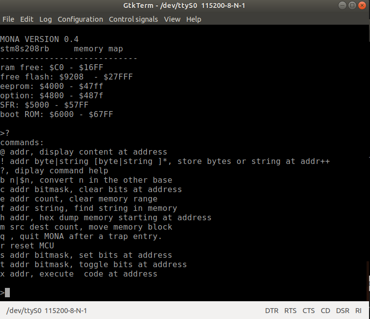

MONA, manuel de l'utilisateur
====
### mise à jour de la version 0.4

Moniteur écris en assembleur.

Ce moniteur peut-être utile pour interagir directement avec le microcontrôleur en observant l'effet produit par la modification des registres de 
contrôle des périphériques. Par exemple pour allumer la LED2 verte sur la carte, la commande **s $500a 32** peut-être utilisée. **$500a** est l'adresse du registre **PC_ODR**  et la LED2 est branchée sur **PC5** d'où le masque 32 qui correspond à **(1<<5)**  pour masquer le bit 5 du registre. 

la commande **t $500a 32** inverse l'état de la LED2.
  
commandes:
----------
* **@ addr** Commande **fetch byte**. Affiche la valeur de l'octet à l'adresse donnée.
* __! addr byte [byte ]*__ Commande **store byte**. Dépose les octets données aux adresses successsives à partir de **addr**.
* **?** Commande **help**. Affiche la liste des commandes.
* **b n|$n|0xhh[hh]** Commande **base convert**. Convertie l'entier dans l'autre base. i.e. dec->hex | hex->dec.
* **c addr bitmask**. Commande **bit clear**. Met les bits masqués à zéro, **addr** adresse de l'octet à modifié.
* **e addr count**. Commande **erase** permet de mettre à zéro une plage de mémoire RAM, EEPROM ou FLASH.
* **f addr string**. Commande find recherche une chaîne ASCII dans la mémoire.
* **h addr**. Commande **hex dump**. Affiche le contenu de la mémoire en hexadécimal par rangée de 8 octets. Pause à chaque rangée. &lt;ESPACE&gt; continue, autre touche termine.
* **m src dest count** Commande **move**. Copie le bloc mémoire de **src** vers **dest**, **count** est le nombre d'octets à copier.
* **q**. Commande **resume**. Cette commande est utilisée pour redémarrer l'application qui a été suspendue par une instruction **trap**.
* **r** Commande **reset**. Réinitialise le MCU.
* **s addr bitmask** Commande **bit set**. Met à 1 les bits masqués. **addr** adresse de l'octet à modifié.
* **t addr bitmask** Commande **bit toggle**. Inverse la valeur des bits masqués. **addr** adresse de l'octet à modifier.
* **x addr** commande **execute**. Exécute le code à l'adresse donnée. i.e. **x $6000** réinialise la carte. Le code peut-être en mémoire RAM.

 Utilisation
 -----------
 
  Le UART3 du STM8S-DISCOVERY est branché sur les broches **TX -> PD5 -> CN7-2** et **RX -> PD6 -> CN7-1**. Il suffit de relier ces 2 broches à un 
  adapteur de niveaux pour port sériel qui est relié à un PC. MONA communique à la vitesse de **115200 BAUD** configuré en **8N1** pas de contrôle de flux.
  
  Personnellement je travaille sur un poste en Ubuntu 18.04 et j'utilise **gtkTerm** comme émulateur de terminal. GtkTerm doit-être configuré pour **CRLF auto** . 
  
  
  
  Le moniteur bloque l'écriture dans la mémoire **FLASH** occupée par le moniteur ainsi que la mémoire **RAM** utilisée par celui-ci.
  
  Lors de la saisie d'une commande la combinaison de touches **CTRL-R** permet de répéter la dernière commande. Mais ça ne fonctionne qui si on
  l'utilise au début de la saisie. Par exemple si après avoir exécuter une fois la commande **t $500a 32** on fait des **&lt;CTRL-R&gt;** suivit de **&lt;ENTER&gt;**
  on peut basculer l'état de la LED2 rapidement.
  
## Syntaxe

Chaque commande est constituée d'une seule lettre qui est suivit par la liste de ses arguments. l'espace est le seul séparateur de la ligne de comamnde. 

Les paramètres numériques des commandes peuvent-être fournis en décimal ou hexadécimal. Les nombres hexadécimals sont identifiés par le premier caractère qui doit-être **$**. La taille maximal d'un entier est de **$ffffff** ce qui correspond à 2^24-1 ou encore en décimal **16 777 215**. Ce choix est fonction de l'espace d'adressage des STM8 qui est de 16Mo. 

Les paramètres chaînes sont fournis entre guillemets **"**. 

## Commandes

Le longueur maximale d'une ligne de commande est de 80 caractères incluant le retour à la ligne qui est remplacé par un **0** pour terminer la chaîne.

Lorsque MONA est prêt à recevoir une commande il affiche le caractère **'>'** en début de ligne. 

### Touches d'édition

La dernière commande exécutée peut-être réaffichée sur la ligne de commande avec la combinaison de touche **&lt;CTRL-R&gt;**. Ça ne fonctionne que si aucun caractère n'a été saisie au préalable. Donc pour répéter la même commande plusieur fois on fait **&lt;CTRL-R&gt;** **&lt;ENTER&gt;** autant de fois que désiré.

La touche **BACKSPACE** permet d'effacer le dernier caractère de la ligne.

**&lt;CTRL-C&gt;** Annule la saisie et retourne une ligne vide.

**&lt;CTRL-D&gt;** Efface la ligne au complet.

**&lt;ENTER&gt;** termine la saisie. 

## Détail de chaque commande

### **?**
```
>?
commands:
@ addr, display content at address
! addr byte|string [byte|string ]*, store bytes or string at addr++
?, diplay command help
b n|$n, convert n in the other base
c addr bitmask, clear bits at address
e addr count, clear memory range
f addr string, find string in memory
h addr, hex dump memory starting at address
m src dest count, move memory block
q , quit MONA after a trap entry.
r reset MCU
s addr bitmask, set bits at address
t addr bitmask, toggle bits at address
x addr, execute  code at address
```

Commande **help**. Affiche la liste des commandes avec une brève description. Cette commande n'accepte aucun paramètre.

### **@ addr** 
```
>@ $8000
$8000=$82 
>@ 32768
32768=130 
>
```

Commande **fetch**. Affiche le contenu d'une location mémoire. Cette commande n'accepte qu'un seul paramètre, soit l'adresse à examiner. Le contenu est affiché dans la même base que l'adresse fournie.

### __! byte|string [byte|string]*__
```
>! $c0 "hello world" 0 "bonjour le monde" 0
```
Commande **store**. Utlisée pour modifier le contenu de la mémoire. On peut modifier tous les types de mémoires: RAM,EEPROM,FLASH,OPTION. Cette commande accepte une liste d'octets ou de chaînes entre guillemets. Les 2 types de données peuvent-être présent en même temps sur la ligne de commande. Notez que MONA n'ajoute pas de **0** à la fin des chaînes. Le nombre de paramètres fournis est limité par la taille maximale d'une ligne de commande qui de 80 caractères.

### **b n|$n
```
>b 10
$0A 
>b $a
10 
```

Commande **base**. Convertit un entier dans l'autre base. Si le paramètre fourni est en décimal l'entier est affiché en hexadécimal et vice-versa.

### **c addr mask**
```
>! $c0  $FF

>c $c0  $11

>@ $c0
$c0=$EE 
```

Commande **clear**. Sert à mettre à **0** les bits indiqués par le paramètre **mask**. **mask** est un octet. Les bits de cet octet qui sont à **1** seront mis à zéro dans l'octet à l'adresse indiquée par **addr**.

### **e addr count**
```
>h $c0
$C0  $EE $65 $6C $6C $6F $20 $77 $6F    ello wo
$C8  $72 $6C $64 $00 $62 $6F $6E $6A   rld bonj
$D0  $6F $75 $72 $20 $6C $65 $20 $6D   our le m
$D8  $6F $6E $64 $65 $00 $00 $00 $00   onde    
$E0  $00 $00 $00 $00 $00 $00 $00 $00           
$E8  $00 $00 $00 $00 $00 $00 $00 $00           
$F0  $00 $00 $00 $00 $00 $00 $00 $00           

>e $c0 28

>h $c0
$C0  $00 $00 $00 $00 $00 $00 $00 $00           
$C8  $00 $00 $00 $00 $00 $00 $00 $00           
$D0  $00 $00 $00 $00 $00 $00 $00 $00           
$D8  $00 $00 $00 $00 $00 $00 $00 $00           
```

Commande **erase**. Sert à mettre à zéro une plage mémoire. Les types de mémoires qui peuvent être mis à zéro sont RAM,FLASH et EEPROM. **addr** est l'adresse début de la plage et **count** est le nombre d'octets à effacer. Le maximum est de 65535 octets. 

### **f addr string**
```
>f $8080 "commands"
Found at address: $8CCB
>h $8ccb
$8CCE  $63 $6F $6D $6D $61 $6E $64 $73   commands
$8CD6  $3A $0A $40 $20 $61 $64 $64 $72   : @ addr

>f $8080 "Commands"    
String not found.
>f $8080 i "Commands"
Found at address: $8CCB 
>h $8ccb
$8CCB  $63 $6F $6D $6D $61 $6E $64 $73   commands
```
Commande **find**. Sert à rechercher une chaîne ASCII dans la mémoire. La recherche débute à l'adresse **addr** et se termine à la première occurence trouvée ou bien lorsque fin de la mémoire a étée atteinte. La recherche distingue les majuscules des minuscules à moins que l'option **i** soit utililsée.

### **h addr**
```
>h $8000
$8000  $82 $00 $81 $1E $82 $00 $81 $F3           
$8008  $82 $00 $81 $EE $82 $00 $81 $EE           
$8010  $82 $00 $81 $EE $82 $00 $81 $EE           
$8018  $82 $00 $81 $EE $82 $00 $81 $EE           
$8020  $82 $00 $81 $EE $82 $00 $82 $42          B
$8028  $82 $00 $81 $EE $82 $00 $81 $EE           
$8030  $82 $00 $81 $EE $82 $00 $81 $EE           
$8038  $82 $00 $81 $EE $82 $00 $81 $EE           
$8040  $82 $00 $81 $EE $82 $00 $81 $EE           
$8048  $82 $00 $81 $EE $82 $00 $81 $EE           
$8050  $82 $00 $81 $EE $82 $00 $81 $EE           
$8058  $82 $00 $81 $EE $82 $00 $81 $EE           
$8060  $82 $00 $81 $EE $82 $00 $81 $EE           
$8068  $82 $00 $81 $EE $82 $00 $81 $EE           
$8070  $82 $00 $81 $EE $82 $00 $81 $EE           
$8078  $82 $00 $81 $EE $82 $00 $81 $EE           
```
Commande **hex dump**. Affiche le contenu d'une plage mémoire en hexadécimal. 8 adresses sont affichées par ligne. Les valeurs qui sont dans l'intervalle **{32..127} voit leur représentation ASCII affiché au bout de la ligne. Dans l'example ci-haut c'est la table des vecteurs d'interruption de MONA qui est affichée.

### m src dest count
```
>! $c0 "hello world"

>h $c0
$C0  $68 $65 $6C $6C $6F $20 $77 $6F   hello wo
$C8  $72 $6C $64 $00 $00 $00 $00 $00   rld     

>m $c0 $d0 11

>h $c0
$C0  $68 $65 $6C $6C $6F $20 $77 $6F   hello wo
$C8  $72 $6C $64 $00 $00 $00 $00 $00   rld     
$D0  $68 $65 $6C $6C $6F $20 $77 $6F   hello wo
$D8  $72 $6C $64 $00 $00 $00 $00 $00   rld     
```
Commande **move**. Copie le contenue de la plage mémoire débutant à l'adresse **src** vers la plage débutant à l'adresse **dest**. **count** est le nombre d'octets à copier.
 
### **q**

Commande **resume** (le 'r' était déjà utilisé). N'est utile que lorsqu'une application utilise l'interruption logicielle **trap**.  Autrement elle n'a aucun effet. Il s'agit d'un ajout de la version 0.3 de MONA. Lorsque l'interruption **TrapHandler** est activée. L'application est interrompue et un message est affiché en conséquence. Eusuite le contenu des registes empilés par l'interruption soit EPC,Y,X,A et CC est affiché puis on se retrouve sur la ligne de commande de MONA. Ceci permet d'examiné les variables de l'application ou même de modifier le code de l'application. On peut par exemple remplacé l'instrcution **trap** par une instruction **nop** et redémarrer l'application à son point d'arrêt avec la commande. **q**.

À titre d'exemple j'ai assemblé avec MONA 0.3 un petit progamme **blink**
```
	.area USER_PROGRAM (ABS)
	.org 0x8e80

blink:
	ld a,LED2_PORT
	xor a,#LED2_MASK
	ld LED2_PORT,a 
	ldw y,#8 
1$: ldw x,#0xffff
2$:	decw x 
	jrne 2$
    decw y 
    jrne 1$
	nop
	jra blink
```
Lorsque MONA démarre il vérifie s'il y a du code à l'adresse **0x8e80** qui est l'addresse du début des programmes utilisateur tel qu'indiqué par *free_flash* au démarrage. Si MONA trouve **0** à cette adresse il entre sur le shell de commande sinon il fait un saut à cette adresse pour exécuter l'applicaton. Notez la présence de l'instruction **nop** dans le code de **blink**. Si on remplace ce **nop** par **trap** le programme va retourner au shell de commande à chaque boucle. On peut alors utiliser les commandes de MONA et pour redémarrer **blink** faire la commande **q**. 

L'instruction **nop** peut-être remplacée par **trap** à partir du shell de commande de MONA. En tout temps on peut arrêter **blink** pour revenir au shell de commande en enfonçant le bouton **USER** sur la carte **NUCLEO-8S208RB**. Voici une capture d'écran pour démonstration. 
```
Program aborted by user.
Registers state at abort point.
--------------------------
EPC: $8E8F 
Y: $08 
X: $4832 
A: $20 
CC: $20 

>h $8e80
$8E80  $C6 $50 $0A $A8 $20 $C7 $50 $0A    P    P 
$8E88  $90 $AE $00 $08 $AE $FF $FF $5A          Z
$8E90  $26 $FD $90 $5A $26 $F6 $9D $20   &  Z&   
$8E98  $E7 $00 $00 $00 $00 $00 $00 $00           

>! $8e96 $83

>x
Program interrupted by a software trap. 'q' to resume
Registers state at abort point.
--------------------------
EPC: $8E97 
Y: $00 
X: $00 
A: $00 
CC: $22 

>q
Program interrupted by a software trap. 'q' to resume
Registers state at abort point.
--------------------------
EPC: $8E97 
Y: $00 
X: $00 
A: $20 
CC: $22 

>! $8e96 $9d

>q

```
Le message **Aborted by user** indique que j'ai utilisé le bouton **USER** pour arrêter blink. 

Ensuite j'utilise la commande **h** pour examiner le contenu binaire du programme. Je vois qu'à l'adresse **$8e96** se trouve l'instruction **$9D**, c'est le **nop**. j'utilise la commande **! $8e96 $83** pour remplacer cette instruction par **trap**. La commande **x** sans argument lance le programme qui se trouve à l'adresse **$8e80**. Dans notre exemple il s'agit du programme **blink**. Mais comme il y a une instruction **trap** à la fin de la boucle le programme s'arrête immédiatement. Le message **Program interrupted by a software trap.** indique la cause de l'arrêt.
On le relance avec la commande **q** et il s'arrête à nouveau lorsqu'il revient à la fin de la boucle.  j'utilise la commande **! $8e96 $9d** pour remplacer l'instruction **trap** par une **nop** et ensuite je démarre le programme avec **q**. Cette fois le programme ne s'arrête pas car il n'y a pas plus d'instruction **trap**. La seule façon de l'arrêter est en pressant le bouton **USER**.

Arrêter le programme avec le bouton **USER** n'a pas le même effet que de l'arrêter avec une instruction **trap** installée à l'intérieur du programme.
Le bouton vide la pile et donc le programme doit-être relancé avec la comamnde **x**. l'instruction **trap** conserve l'état de la pile et retourne au programme en sortant de **TrapHandler** par l'instruction **iret**. 


### **r**

Commande **reboot**. Réinitilise le MCU comme si on avait enfoncé le bouton **RESET** sur la carte. La commande n'accepte aucun paramètre.

### s addr mask
```
>@ $c0
$c0=$00 
>s $c0 $11

>@ $c0
$c0=$11 
>
```

Commande **set**. Met à **1** les bits indiquées par **mask** pour l'octet qui est situé à l'adressse **addr**.  C'est l'inverse de la commande **c**. Pour allumer la LED2 sur la carte on peut faire:
```
>s $500a $20
```

### **t addr mask**
```
>t $500a 32
```
Commande **toggle**. Inverse l'état des bits indiqués par **mask** pour l'octet qui se trouve à l'adresse **addr**. Dans l'exemple c-haut l'état de la LED2 est inversé. C'est à dire que s'il est éteint il s'allume ou inversement il s'éteint. 

### **x [addr]**
```
>h $8e80
$8E80  $C6 $50 $0A $A8 $20 $C7 $50 $0A    P    P 
$8E88  $90 $AE $00 $08 $AE $FF $FF $5A          Z
$8E90  $26 $FD $90 $5A $26 $F6 $9D $20   &  Z&   
$8E98  $E7 $00 $00 $00 $00 $00 $00 $00           

>m $8e80 $c0 $19

>h $c0
$C0  $C6 $50 $0A $A8 $20 $C7 $50 $0A    P    P 
$C8  $90 $AE $00 $08 $AE $FF $FF $5A          Z
$D0  $26 $FD $90 $5A $26 $F6 $9D $20   &  Z&   
$D8  $E7 $00 $00 $00 $00 $00 $00 $00           

>x $c0

```
Commande **execute**. Permet de lancer un programme inscris en mémoire ROM,FLASH ou RAM.  Depuis la version 0.3 le paramètre **addr** est facultatif s'il y a une application d'installée à l'adresse **$8e80**. Mais on peut inscrire une application en RAM et la lancer comme illustré ci-haut.
Dans cet exemple je copie le programme **blink** dans la mémoire RAM à l'adresse **$C0** pour ensuite l'exécuté  avec la commande **x $c0**.

## Conclusion

J'ai plein d'idées pour améliorer MONA. Par exemple je pourrais inclure un désassembleur, un assembleur et même transformer MONA en un mini système d'exploitation qui offrirait des services aux applications.

