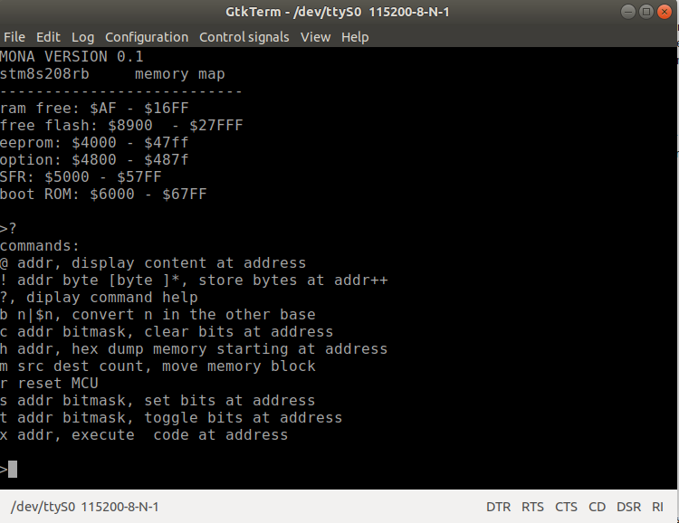

MONA
====
Moniteur écris en assembleur

Ce moniteur peut-être utile pour interagir directement avec le microcontrôleur en observant l'effet produit par la modification des registres de 
contrôle des périphériques. Par exemple pour allumer la LED2 verte sur la carte, la commande **s $500a 32** peut-être utilisée. **$500a** est l'adresse du registre
**PC_ODR**  et la LED2 est branchée sur **PC5** d'où le masque **(1<<5)** pour masquer le bit 5 du registre. 

la commande **t $500a 32** inverse l'état de la LED2.
  
commandes:
----------
* **@ addr** Affiche la valeur de l'octet à l'adresse donnée.
* __! addr byte [byte ]*__ Dépose les octets données aux adresses successsives à partir de **addr**.
* **?** Affiche la liste des commandes.
* **b n|$n** Convertie l'entier dans l'autre base. i.e. dec->hex | hex->dec.
* **c addr bitmask** Met les bits masqués à zéro, **addr** adresse de l'octet à modifié.
* **h addr** Affiche le contenu de la mémoire en hexadécimal par rangée de 8 octets. Pause à chaque rangée. &lt;ESPACE&gt; continue, autre touche termine.
* **m src dest count** Copie le bloc mémoire de **src** vers **dest**, **count** est le nombre d'octets à copier.
* **r**  Réinitialise le MCU.
* **s addr bitmask** Met à 1 les bits masqués. **addr** adresse de l'octet à modifié.
* **t addr bitmask** Inverse la valeur des bits masqués. **addr** adresse de l'octet à modifier.
* **x addr** Exécute le code à l'adresse donnée. i.e. **x $6000** réinialise la carte. Le code peut-être en mémoire RAM.

 Utilisation
 -----------
 
  Le UART3 du STM8S-DISCOVERY est branché sur les broches **TX -> PD5 -> CN7-2** et **RX -> PD6 -> CN7-1**. Il suffit de relier ces 2 broches à un 
  adapteur de niveaux pour port sériel qui est relié à un PC. MONA communique à la vitesse de **115200 BAUD** configuré en **8N1** pas de contrôle de flux.
  
  Personnellement je travaille sur un poste en Ubuntu 18.04 et j'utilise **gtkTerm** comme émulateur de terminal **VT100**. GtkTerm doit-être configuré pour **CRLF auto** . 
  
  
  
  Le moniteur bloque l'écriture dans la mémoire **FLASH** occupée par le moniteur ainsi que la mémoire **RAM** utilisée par celui-ci.
  
  Lors de la saisie d'une commande la combinaison de touches **CTRL-R** permet de répéter la dernière commande. Mais ça ne fonctionne qui si on
  l'utilise au début de la saisie. Par exemple si après avoir exécuter une fois la commande **t $500a 32** on fait des **&lt;CTRL-R&gt;** suivie de **&lt;ENTER&gt;**
  on peut basculer l'état de la LED2 rapidement.
  
  Pour une description du code source de MONA consulter le document suivant  [Étude du code source](MONA.md).

  

