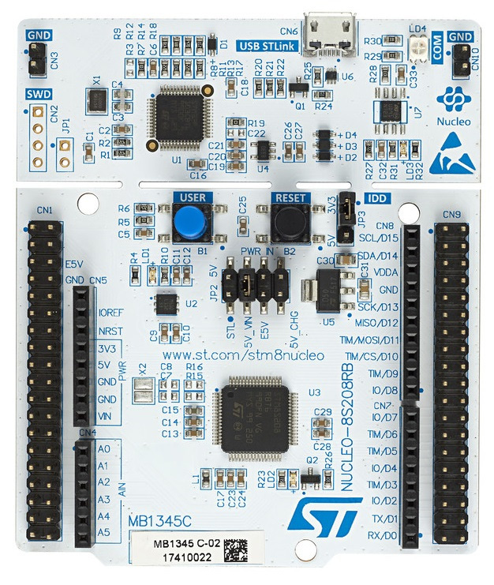

[//]: # (auteur: Jacques Deschênes)
[//]: # (Date: 2019/10/30)
[//]: # (Copyright Jacques Deschênes, 2019)
[licence: CC-BY-SA 2.0](https://creativecommons.org/licenses/by-sa/2.0/fr/) 

# STM8 Nucleo
En même temps que j'apprends à programmer les STM8 en assembleur en utilisant **sdasstm8** et la carte  [NUCLEO-8S208RB](https://www.st.com/en/evaluation-tools/nucleo-8s208rb.html), j'ai décidé d'en faire un tutoriel. Cette carte a des connecteurs (CN4,CN5,CN7 et CN8) qui sont compatible avec les cartes d'extension Arduino. Les connecteurs CN1 et CN2 permettent l'installation de cartes d'extension vendu par STMicroelectronics.

**sdasstm8** est la version de l'assembleur du projet SDCC (*Small  Device C Compiler*)  qui cible les microcontrôleurs **STM8** de STMicroelectronics.

### La carte NUCLEO-8S208RB utilisée pour ce tutoriel

## organisation
* **docs** contient des fichiers PDF fournis par le fabriquant STMicroelectronics ainsi que d'autres documents utiles.
* **docs/images**   Contient les images qui sont affichées dans les différents fichiers __*.md__.
* **inc** Contient les fichiers d'assembleur __*.inc__ d'usage pour les différents projets. 
* **chx_nom** pour chaque chapitre du tutoriel il y a un dossier dont le nom est de cette forme. Par exemple le dossier **ch1_blink** est le chapitre 1 du tutoriel avec le progamme exemple **blink.asm**. Chacun de ces dossiers contient un fichier **readme.md** qui contient le texte du tutoriel pour ce chapitre. Le contenu du fichier est affiché automatiquement lors qu'on passe d'un dossier à l'autre sur [github](https://github.com/picatout/stm8_nucleo).
* **lib**  Contient les fichiers librairies compilés. 
* **libs_src** Contient les fichier sources des librairies.
* **mona**  Contient le projet [MONA](mona/readme.md) qui est une Moniteur écris en asssembleur. 

## Tutoriel
### Chapitre 1 [blink.asm](ch1_blink/readme.md)
### Chapitre 2 [button.asm](ch2_btn/readme.md)
### Chapitre 3 [hello.asm](ch3_hello/readme.md)
### Chapitre 4 [arguments et variables locales](ch4/readme.md)
### Chapitre 5 [C et assembleur](ch5/readme.md)

## fichiers à consulter

* [processeur STM8](stm8.md) pour une brève présentation du cpu STM8
* [manuel de programmation du STM8](docs/pm0044_stm8_programming.pdf)
* [feuillet de spécification du STM8S208](docs/stm8s208rb.pdf)
* [manuel de l'utilisateur de la carte NUCLEO-8S208RB](docs/nucleo-8s208rb_user_manual.pdf)
* [référence STM8S](docs/stm8s_reference.pdf) pour une description du fonctionnement des périphériques utilisés dans les MCU STM8S.
* [documentation de SDAS](docs/asmlnk.txt) documentation de l'assembleur SDAS faisant parti du projet SDCC.