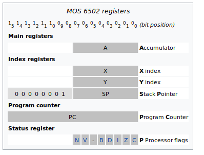
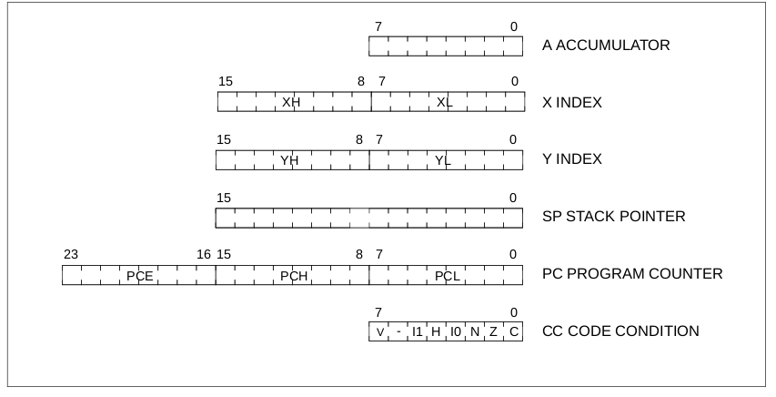

# processeur STM8

Ce document est une brève présentation du CPU STM8 au coeur des microcontrôleurs 8 bits de ST Microelectronics.

Le STM8 est un descendant du mythique MOS 6502 largement utilisé dans les années 70 entre autre dans le **Apple II**. Il est une extension de 
ce dernier. Le modèle de programmation des 2 CPU est présenté ici bas pour comparaison.

processeur MOS 6502

 

processeur STM8

 

Comme on le voit le STM8 étend les registres d'index **X** et **Y** à 16 bits ainsi que le pointeur de pile **SP**. Dans le 6502 les 8 bits supérieurs de **SP** était fixés à la valeur **0x01** ce qui veut dire que la pile était forcément située entre les adresses 0x0100 et 0x01ff. Le STM8 permet de la situer n'importe où entre 0x0000 et 0xffff. 

On constate aussi que le compteur ordinal est de 24 bits au lieu de 16 ce qui permet un espace d'adressage linéaire de 16Mo alors que le 6502 est limité à 64Ko.  

Les indicateurs booléens **CC** (Condition Code) sont aussi différents bien qu'il y en est 7 dans les 2 cas. 

Le STM8 est en architecture Harvard contrairement au 6502 qui est en architecture Von Neumann.  Architecture Harvard signifie que la mémoire programme est sur un bus différent de la mémoire des données. Lorsque la mémoire programme est effacées tous les bits sont à **0** alors que pour la plupart des MCU ils sont tous à **1**. Ces processeurs permettent aussi de programmer ou effacer 1 seul octet à la fois autre propriété peu commune.

Même s'il s'agit d'une architecture Harvard le cpu peut exécuter un programme situé dans la mémoire RAM. C'est plus lent cependant car la mémoire flash est accédée 32 bits à la fois (4 octets) tandis que la mémoire RAM est accédée 8 bits à la fois (1 octet). Du point de vue de la programmation cet accès indifférencié de tout l'espace mémoire est très pratique. Cet accès à la mémoire les distingues des MCU AVR et PIC qui ne peuvent exécuter du code à partir de la mémoire RAM et requièrent une procédure particulière pour lire les données en mémoire flash.

## jeu d'instructions

Le STM8 possède un jeu d'instructions plus étendu que le 6502 pour accommoder son espace d'adressage supplémentaire et l'ajout d'autres fonctionnalités. Il possède 80 instructions avec 18 modes d'adressage différents. De plus il y a un multiplicateur et un diviseur matériel incorporé au processeur ce qui améliore grandement la performance des traitements numériques.

Au niveau de l'assembleur les mnénoniques utilisés sont les même pour les 2 processeurs pour les instructions communes. Cependant le code binaire généré est différent. On ne peut donc pas exécuter un binaire du 6502 sur le STM8, il faut réassembler le code source.

## Avantage des STM8
* L'architecture de type accumulateur est moins coûteuse qu'un architecture de type **registers file** comme les AVR. Ça se reflète donc dans le prix.
* L'espace d'adressage linéaire qui ne fait aucune distinction entre mémoire flash et mémoire RAM pour la lecture et l'exécution.
* Le multiplicateur et le diviseur en matériel.
* Cartes de développement et clones du programmeur/débogueur STLINK très économique disponible en provenance d'Asie. 
* Supporté par l'IDE Arduino, voir https://tenbaht.github.io/sduino/
